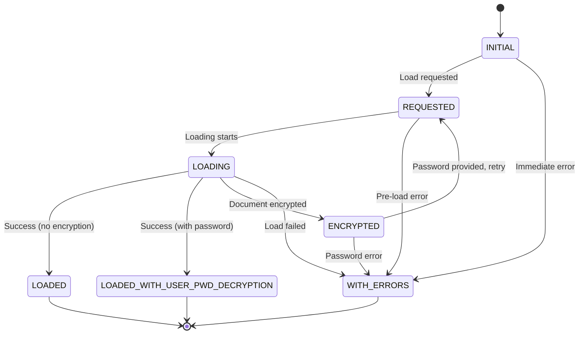
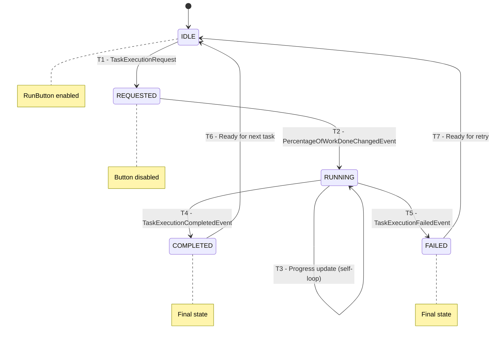
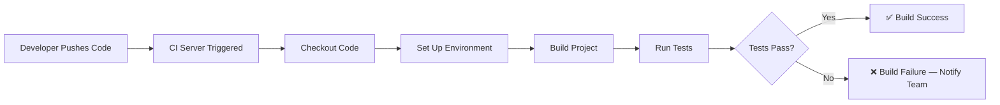
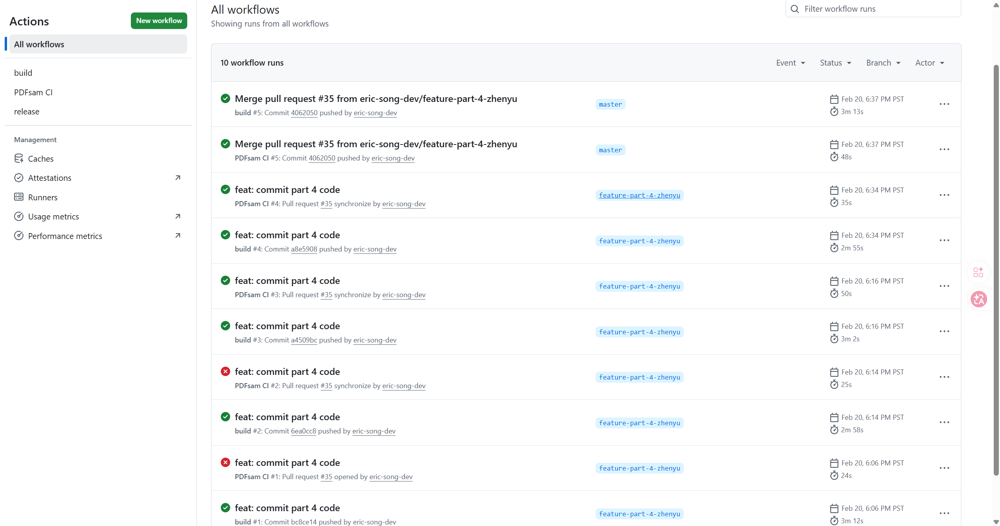
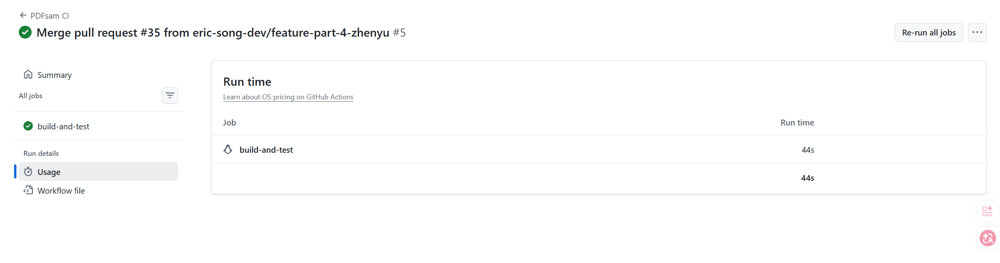
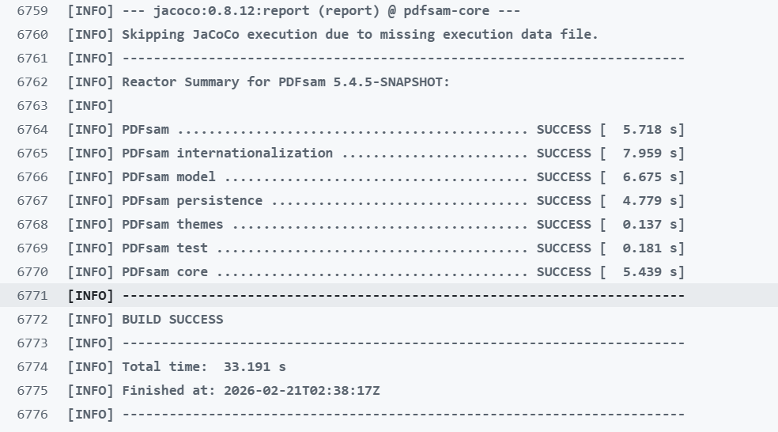
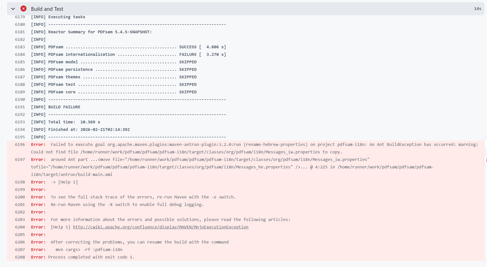
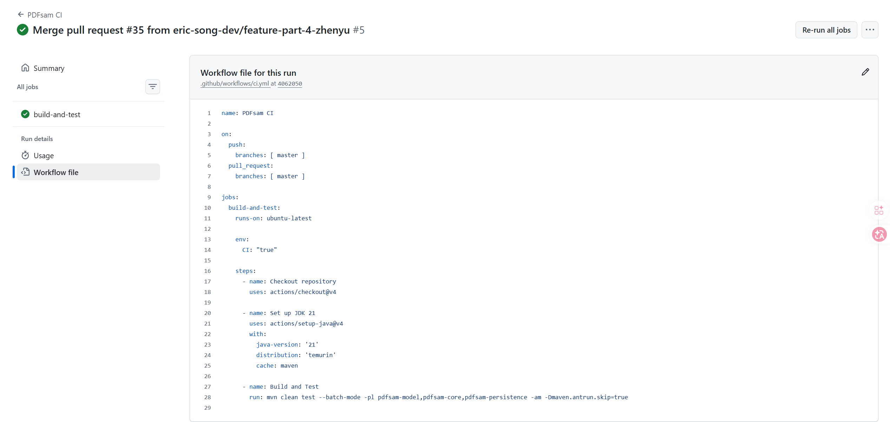
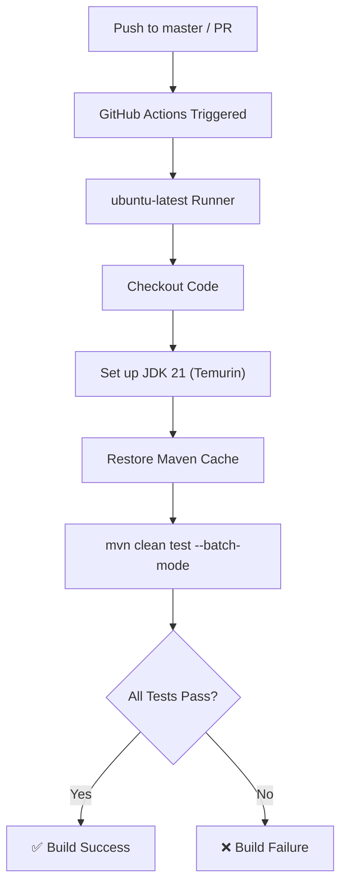

# SWE 261P Software Testing and Analysis Final Project Report
## PDFsam Basic: Comprehensive Testing and Analysis


<p align="left">
  
  
  
</p>

**Repo Github Link:**
https://github.com/eric-song-dev/pdfsam

**Team Members:**
* Kingson Zhang: kxzhang@uci.edu
* Zian Xu: zianx11@uci.edu
* Zhenyu Song: zhenyus4@uci.edu

This report documents the comprehensive testing and analysis of **PDFsam Basic**, a free, open-source PDF manipulation tool. The report covers six interconnected areas of software testing and analysis:

| Chapter | Topic | Key Techniques |
|:-------:|-------|---------------|
| 1 | Functional Testing & Partitioning | Equivalence partitioning, boundary value analysis |
| 2 | Finite State Machine Testing | State/transition coverage, FSM modeling |
| 3 | White Box Testing & Coverage | JaCoCo, line/branch coverage |
| 4 | Continuous Integration | GitHub Actions, automated build & test |
| 5 | Testable Design & Mocking | Stubs, mocks, dependency injection |
| 6 | Static Analysis | CodeQL, SpotBugs |

<div style="page-break-after: always;"></div>

## 📂 Table of Contents

[TOC]

<div style="page-break-after: always;"></div>

# Chapter 1: Functional Testing and Partitioning

## SWE 261P Software Testing and Analysis - Part 1 Report


<p align="left">
  
  
  
</p>

**Repo Github Link:**
https://github.com/eric-song-dev/pdfsam

**Team Members:** 
* Kingson Zhang: kxzhang@uci.edu
* Zian Xu: zianx11@uci.edu
* Zhenyu Song: zhenyus4@uci.edu

This report documents the systematic functional testing process of **PDFsam Basic**, focusing on equivalence partitioning across core modules: Merge, Rotate, and Extract.

<div style="page-break-after: always;"></div>

## 🚀1. Introduction

### 1.1 Repo Introduction

PDFsam (PDF Split And Merge) Basic is a free, open-source, multi-platform desktop application designed to perform various operations on PDF files. PDFsam has become one of the most popular tools for PDF manipulation, offering functionality ranging from simple page extraction to complex document merging operations.

### 1.2 Purpose and Features

PDFsam Basic provides the following core functionalities:

| Feature | Description |
|---------|-------------|
| **Alternate Mix** | Interleave pages from multiple PDF documents |
| **Backpages** | Add backpages to existing PDF documents |
| **Extract** | Extract specific pages or page ranges from PDF documents |
| **Merge** | Combine multiple PDF files into a single document with options for bookmarks, forms, and page normalization |
| **Rotate** | Rotate PDF pages by 90°, 180°, or 270° degrees |
| **Split** | Divide PDFs by page count, size, or bookmarks |

### 1.3 Technical Overview

> [!IMPORTANT]
> **Total Project Scale:** 734 files, **36,281 Logical Lines of Code (LLOC)**, and 15,045 comments.

<details>
<summary>📊Click to View LOC Details</summary>

## Languages
| language | files | code | comment | blank | total |
| :--- | ---: | ---: | ---: | ---: | ---: |
| Java | 622 | 29,515 | 14,734 | 6,099 | 50,348 |
| XML | 45 | 4,087 | 48 | 153 | 4,288 |
| PostCSS | 20 | 1,642 | 152 | 366 | 2,160 |
| Markdown | 3 | 360 | 0 | 135 | 495 |
| YAML | 5 | 176 | 14 | 45 | 235 |
| Java Properties | 22 | 134 | 0 | 4 | 138 |
| Batch | 4 | 107 | 33 | 39 | 179 |
| HTML | 2 | 92 | 2 | 2 | 96 |
| Shell Script | 4 | 85 | 62 | 23 | 170 |
| C# | 1 | 48 | 0 | 3 | 51 |
| JSON | 6 | 35 | 0 | 0 | 35 |

</details>

The project is primarily written in Java (approx. 82%), consisting of roughly 35000 lines of code. [View LOC](./.VSCodeCounter)

<div style="page-break-after: always;"></div>

### 1.4 Project Architecture

PDFsam follows a modular multi-project Maven structure:

```
pdfsam/
├── pdfsam-basic          # Main application entry point
├── pdfsam-core           # Core utilities and support classes
├── pdfsam-fonts          # Font resources
├── pdfsam-gui            # GUI components and controllers
├── pdfsam-i18n           # Internationalization
├── pdfsam-model          # Domain model classes
├── pdfsam-persistence    # Data persistence layer
├── pdfsam-service        # Business services
├── pdfsam-test           # Test utilities
├── pdfsam-themes         # UI themes
├── pdfsam-ui-components  # Reusable UI components
└── pdfsam-tools/         # PDF manipulation tools
    ├── pdfsam-merge
    ├── pdfsam-rotate
    ├── pdfsam-extract
    ├── pdfsam-simple-split
    ├── pdfsam-split-by-size
    ├── pdfsam-split-by-bookmarks
    ├── pdfsam-alternate-mix
    └── pdfsam-backpages
```

The application relies heavily on the **Sejda** library for low-level PDF operations, providing a robust foundation for document manipulation.

<div style="page-break-after: always;"></div>

## 📝2. Build Documentation

### 2.1 Prerequisites

Before building PDFsam, ensure the following tools are installed:

- **Java Development Kit (JDK)**: Version 21 (NOT JDK 11)
- **Apache Maven**: Build tool for dependency management
- **Git**: For cloning the repository
- **Gnu gettext**: Required for internationalization
  - **Windows**: Download from [mlocati/gettext-iconv-windows](http://mlocati.github.io/gettext-iconv-windows/)
  - **macOS**: Install via Homebrew (`brew install gettext`) or use Docker
  - **Linux**: Usually pre-installed or available via package manager

### 2.2 Cloning the Repository

```bash
git clone https://github.com/torakiki/pdfsam.git
cd pdfsam
```

### 2.3 Building the Project

PDFsam uses Java 21's preview features (Foreign Function & Memory API), so the `--enable-preview` flag is required:

```bash
# Compile the project
mvn clean compile
```

```bash
# Package the application
mvn clean package -DskipTests
```

```bash
# Build with tests
mvn clean install -DskipTests
```

### 2.4 Running the Application

After successful compilation, the application can be run using:

```bash
cd pdfsam-basic
```

```bash
mvn exec:exec
```

<div style="page-break-after: always;"></div>

### 2.5 IDE Setup

For IntelliJ IDEA or Eclipse:

1. Import as Maven project
2. Enable preview features in compiler settings
3. Set Java 21 as the project SDK
4. Find and run ./pdfsam-basic/src/main/java/org/pdfsam/basic/App.java

<div style="page-break-after: always;"></div>

## 🧪3. Existing Test Cases

### 3.1 Testing Frameworks

PDFsam employs a comprehensive testing stack:

| Framework | Version | Purpose |
|-----------|---------|---------|
| **JUnit 5 (Jupiter)** | Latest | Unit testing framework |
| **Mockito** | Latest | Mock object creation |
| **AssertJ** | Latest | Fluent assertions |

### 3.2 Test Organization

Tests are organized following Maven conventions:

```
src/
├── main/java/        # Production code
└── test/java/        # Test code
    └── org/pdfsam/
        └── tools/
            ├── merge/
            │   ├── MergeParametersBuilderTest.java
            │   ├── MergeOptionsPaneTest.java
            │   └── MergeSelectionPaneTest.java
            ├── rotate/
            │   └── ...
            └── extract/
                └── ...
```

### 3.3 Test Categories

Our code creates a few new testing components. For the first lab testing, we will be primarily testing the pdf manipulation tools found in the tools folder, specifically the extract, merge, and rotate functionality. Below are following currently implemented. As the project continues, we will continue to add more testing.

1. **Unit Tests**: Isolated component testing with mocks
2. **Integration Tests**: Testing component interactions

<div style="page-break-after: always;"></div>

### 3.4 Running Tests

```bash
# Run all tests
mvn test
```

```bash
# Run tests for a specific module
mvn test -pl pdfsam-tools/pdfsam-rotate
```

```bash
# Run a specific test class
cd pdfsam-tools/pdfsam-rotate
mvn test -Dtest=RotateParametersBuilderTest
```

<div style="page-break-after: always;"></div>

## ✨4. Partition Testing

### 4.1 Motivation for Systematic Functional Testing

Software testing faces a fundamental challenge: **exhaustive testing is impossible**. For any non-trivial program, the space of possible inputs is effectively infinite. Consider a simple function that takes a 32-bit integer—testing all 4.3 billion possible values is impractical, and real-world inputs are far more complex.

**Systematic functional testing** addresses this by:
- Treating the software as a "black box" based on its specification
- Identifying meaningful categories of inputs
- Ensuring representative coverage of the input domain

This approach is essential because:
1. **Ad-hoc testing** misses edge cases and boundary conditions
2. **Random testing** provides poor coverage of critical scenarios
3. **Developer intuition** often overlooks non-obvious failure modes

### 4.2 Partition Testing Concepts

**Partition testing** (also known as equivalence partitioning) is a systematic technique that:

1. **Divides the input domain** into partitions where the program is expected to behave equivalently for all values within each partition
2. **Selects representative values** from each partition
3. **Tests boundary values** at partition edges where defects often lurk

**Key principles:**

- **Completeness**: Partitions cover the entire input domain
- **Disjointness**: Partitions don't overlap (each input belongs to exactly one partition)
- **Homogeneity**: All values in a partition should trigger similar behavior

**Benefits of partition testing:**
- Reduces test cases while maintaining effectiveness
- Provides systematic coverage documentation
- Identifies missing test cases
- Focuses testing effort on distinct behaviors

<div style="page-break-after: always;"></div>

### 4.3 Zhenyu's Partition Testing: Merge Feature

#### 4.3.1 Feature Description

The feature under test is the **PDF Merge Configuration**, specifically the `MergeParametersBuilder` class. This component is responsible for collecting user inputs and settings to construct a valid `MergeParameters` object, which drives the actual merge process. It handles critical configuration options such as:
- Input PDF files and their order.
- Output file destination and overwrite policies.
- Processing options (compression, versioning).
- Content policies (Outline/Bookmarks, Table of Contents, AcroForms handling).
- Page manipulation (normalization, blank pages for odd-numbered files).

#### 4.3.2 Partitioning Scheme

To ensure robust coverage of the configuration logic, the input space was partitioned based on **builder state complexity** and **input validity**:

1.  **Default State Partition**: The builder is used without any explicit configuration.
    -   *Goal*: specific verification of safe defaults.
    -   *Representative Input*: An empty `MergeParametersBuilder` instance.
2.  **Fully Configured Partition**: The builder is provided with explicit, non-default values for every available setting.
    -   *Goal*: Verify that all user choices are correctly captured and propagated.
    -   *Representative Input*: A builder with inputs, `PdfVersion.VERSION_1_6`, `OutlinePolicy.ONE_ENTRY_EACH_DOC`, `ToCPolicy.DOC_TITLES`, etc.
3.  **Input Sequence Partition**: Multiple inputs added in a specific order.
    -   *Goal*: specific verification that the merge order respects the user's input sequence.
    -   *Representative Input*: Inputs `["1.pdf", "2.pdf", "3.pdf"]` added sequentially.
4.  **Redundant/Edge-Case Input Partition**: Duplicate or redundant inputs.
    -   *Goal*: specific verification of deduplication logic.
    -   *Representative Input*: The same `PdfMergeInput` object added twice.
5.  **Invalid Input Partition**: Null or missing values.
    -   *Goal*: Ensure null safety and robustness.
    -   *Representative Input*: `addInput(null)` and setting policies to `null`.

#### 4.3.3 Test Implementation

The partition tests are implemented in <a href="https://github.com/eric-song-dev/pdfsam/blob/master/pdfsam-tools/pdfsam-merge/src/test/java/org/pdfsam/tools/merge/ZhenyuMergePartitionTest.java">ZhenyuMergePartitionTest.java</a> using JUnit 5 and Mockito.

-   **`testDefaults()`**: Covers the *Default State Partition*. Asserts that a fresh builder produces parameters with expected defaults (e.g., `OutlinePolicy.RETAIN`, `ToCPolicy.NONE`, `isCompress` false).
-   **`testFullConfiguration()`**: Covers the *Fully Configured Partition*. Sets every property (e.g., `compress(true)`, `version(1.6)`) and asserts the resulting `MergeParameters` object reflects these exact values.
-   **`testAddInput_PreservesOrder()`**: Covers the *Input Sequence Partition*. Adds three mock inputs and verifies they appear in the exact same order in the final list.
-   **`testAddInput_Deduplicates()`**: Covers *Redundant Input Partition*. Adds the same input object twice and asserts the list size is 1.
-   **`testAddInput_IgnoresNull()`** and **`testNullPolicies_AreAllowed()`**: Covers the *Invalid Input Partition*. Verifies that adding `null` inputs serves no operation and that setting null policies doesn't crash the builder.

<div style="page-break-after: always;"></div>

### 4.4 Zian's Partition Testing: Rotate Feature

#### 4.4.1 Feature Description

The `RotateParametersBuilder` class constructs parameters for PDF page rotation. It handles:
- Rotation angle selection
- Page selection (all, odd, even, or custom ranges)
- Multiple input sources
- Output file naming

#### 4.4.2 Partitioning Scheme

This test suite implements a systematic **Input Domain Partitioning** strategy to validate the `RotateParametersBuilder`. The logic is decomposed into four primary dimensions:

###  Dimension 1: Angular Transformation Mapping
* `[P1a]` Systematic Rotation (90°):** Validates the fundamental mapping of a quadrant clockwise rotation using `Rotation.DEGREES_90`. It ensures that the Builder correctly encapsulates the angular intent into the final task parameters.

###  Dimension 2: Predefined Page Selection Strategy
* `[P2a]` (Identity Mapping):** Verifies the "Rotate All" logic using `PredefinedSetOfPages.ALL_PAGES`. For a standard 10-page document, it asserts that all 10 pages are correctly targeted for transformation.
* `[P2b]` (Odd Parity Filter):** Evaluates the parity-based filtering using `PredefinedSetOfPages.ODD_PAGES`. It confirms that for a 10-page document, only the 5 odd-indexed pages are selected.

###  Dimension 3: Parameter Precedence & Override Logic
* `[P3a]` (Fallback Mechanism):** Confirms the system's "Safe Default" behavior. When no custom ranges are provided (`null`), the system successfully falls back to the global predefined strategy (e.g., Odd Pages).
* `[P3b]` (Complex Range Merging):** Validates the override mechanism using a `HashSet` of multiple disjoint `PageRange` objects (e.g., pages 1-3 and 7-9). It ensures custom user input takes precedence over global settings.

###  Dimension 4: Input Batch Cardinality
* `[P4a]` (Zero Input):** Tests the system's state when no files are added, ensuring `hasInput()` correctly returns `false` to prevent null-pointer operations.
* `[P4b]` (Multi-Source):** Verifies the bulk processing capability by injecting 3 distinct PDF sources. It asserts that the `InputSet` size matches the expected count of 3.

###  Combined Scenario: Integration Verification
* **Cross-Partition Validation:** A composite test case that simultaneously evaluates 90° rotation, multiple input sources with heterogeneous selection strategies (one file with custom ranges, another with predefined sets), and output target consistency.

#### 4.4.3 Test Implementation

The partition tests are implemented in <a href="https://github.com/eric-song-dev/pdfsam/blob/master/pdfsam-tools/pdfsam-rotate/src/test/java/org/pdfsam/tools/rotate/ZianRotatePartitionTest.java">ZianRotatePartitionTest.java</a> using JUnit 5, AssertJ, and Mockito.

- **`rotation90Degrees()`**: Covers the *Angular Transformation Partition*. It asserts that when a 90° clockwise rotation is set, the builder correctly maps the `Rotation.DEGREES_90` constant to the resulting task parameters.
- **`allPages()` and `oddPages()`**: Cover the *Predefined Page Set Partition*. These tests simulate a 10-page document and verify that the selection logic correctly calculates the expected page count (e.g., all 10 pages for `ALL_PAGES` vs. 5 pages for `ODD_PAGES`).
- **`noCustomRange()`**: Covers the *Fallback Strategy Partition*. It verifies that if no specific page ranges are provided, the builder successfully defaults to the predefined selection type (e.g., rotating only odd pages).
- **`multipleCustomRanges()`**: Covers the *Custom Override Partition*. It uses a `HashSet` of multiple `PageRange` objects (e.g., pages 1-3 and 7-9) to ensure that explicit user-defined ranges correctly take precedence over global predefined settings.
- **`noInputs()` and `multipleSources()`**: Cover the *Input Cardinality Partition*. These tests establish the system's boundary behavior, asserting that `hasInput()` returns `false` when empty and correctly tracks the size of the input set when multiple PDF sources are injected.
- **`combinedPartitions()`**: Covers the *Integration Scenario*. This comprehensive test validates a complex state where multiple files are processed simultaneously using heterogeneous strategies—one file with a custom range and another using a predefined set—ensuring the builder maintains state integrity across bulk operations.

<div style="page-break-after: always;"></div>

### 4.5 Kingson's Partition Testing: Extract Feature

#### 4.5.1 Feature Description

The `ExtractParametersBuilder` class constructs parameters for extracting pages from PDFs. It handles:
- Page selection expressions (ranges, individual pages, keywords)
- Selection inversion
- Separate file output per range
- Optimization policies
- Bookmark handling

#### 4.5.2 Partitioning Scheme

**Partition 1: Page Selection Type**

| Partition | Description | Representative Value |
|-----------|-------------|---------------------|
| P1a: Single page | One page number | `"5"` |
| P1b: Single range | Contiguous range | `"1-10"` |
| P1c: Multiple ranges | Non-contiguous ranges | `"1-5,10-15,20"` |
| P1d: Last keyword | Special 'last' page | `"last"` |

*Rationale*: Different selection types exercise different parsing and processing paths.

**Partition 2: Selection Inversion**

| Partition | Description | Representative Value |
|-----------|-------------|---------------------|
| P2a: Normal | Extract specified pages | `invertSelection = false` |
| P2b: Inverted | Extract all EXCEPT specified | `invertSelection = true` |

*Rationale*: Inversion fundamentally changes the extraction logic.

**Partition 3: Output File Mode**

| Partition | Description | Representative Value |
|-----------|-------------|---------------------|
| P3a: Single file | All pages in one output | `separateForEachRange = false` |
| P3b: Separate files | One file per range | `separateForEachRange = true` |

*Rationale*: Affects output file generation strategy.

<div style="page-break-after: always;"></div>

## 📋5. Test Implementation Summary

### 5.1 New Test Files

| File | Location | Team Member |
|------|----------|-------------|
| <a href="https://github.com/eric-song-dev/pdfsam/blob/master/pdfsam-tools/pdfsam-merge/src/test/java/org/pdfsam/tools/merge/ZhenyuMergePartitionTest.java">ZhenyuMergePartitionTest.java</a> | `pdfsam-tools/pdfsam-merge/src/test/java/org/pdfsam/tools/merge/` | Zhenyu Song |
| <a href="https://github.com/eric-song-dev/pdfsam/blob/master/pdfsam-tools/pdfsam-rotate/src/test/java/org/pdfsam/tools/rotate/ZianRotatePartitionTest.java">ZianRotatePartitionTest.java</a> | `pdfsam-tools/pdfsam-rotate/src/test/java/org/pdfsam/tools/rotate/` | Zian Xu |
| <a href="https://github.com/eric-song-dev/pdfsam/blob/master/pdfsam-tools/pdfsam-extract/src/test/java/org/pdfsam/tools/extract/KingsonExtractPartitionTest.java">KingsonExtractPartitionTest.java</a> | `pdfsam-tools/pdfsam-extract/src/test/java/org/pdfsam/tools/extract/` | Kingson Zhang |

### 5.2 Running the Partition Tests

```bash
# Run individual partition tests
mvn test -pl pdfsam-tools/pdfsam-merge -Dtest=ZhenyuMergePartitionTest
mvn test -pl pdfsam-tools/pdfsam-rotate -Dtest=ZianRotatePartitionTest
mvn test -pl pdfsam-tools/pdfsam-extract -Dtest=KingsonExtractPartitionTest
```

<div style="page-break-after: always;"></div>

## 🎯6. Conclusion

This report documents our analysis of PDFsam Basic, a robust PDF manipulation tool with a well-structured codebase and comprehensive existing test suite. Through systematic partition testing, we have:

1. **Identified key features** suitable for functional testing
2. **Designed partitioning schemes** that provide systematic coverage of input domains
3. **Implemented JUnit 5 tests** that exercise each partition with representative values
4. **Documented our approach** to serve as a foundation for future testing efforts

The partition testing methodology demonstrates its value in revealing potential edge cases and ensuring comprehensive coverage that ad-hoc testing might miss.

The next addition to our testing will include Finite State Machine testing, which will test the different states of the program.

<div style="page-break-after: always;"></div>

# Chapter 2: Finite State Machine Testing

## SWE 261P Software Testing and Analysis - Part 2 Report


<p align="left">
  
  
  
</p>

**Repo Github Link:**
https://github.com/eric-song-dev/pdfsam

**Team Members:** 
* Kingson Zhang: kxzhang@uci.edu
* Zian Xu: zianx11@uci.edu
* Zhenyu Song: zhenyus4@uci.edu

This report documents the systematic Finite State Machine (FSM) testing process of **PDFsam Basic**, covering three distinct features modeled as FSMs.

<div style="page-break-after: always;"></div>

## 🎯 1. Finite Models in Testing

### 1.1 What Are Finite Models?

**Finite models** are abstract representations of software behavior using a finite number of states and transitions. They allow testers to:

1. **Model complex behavior simply**: Reduce infinite input spaces to manageable state spaces
2. **Visualize system behavior**: Communicate expected behavior through diagrams
3. **Derive test cases systematically**: Generate tests that cover all states and transitions

### 1.2 Why Finite Models Are Useful for Testing

Finite models, particularly **Finite State Machines (FSMs)**, provide several key benefits:

| Benefit | Description |
|---------|-------------|
| **Systematic Coverage** | Ensure all states and transitions are tested |
| **Defect Detection** | Identify missing transitions and invalid state combinations |
| **Documentation** | Serve as executable specifications |
| **Regression Testing** | Provide baseline for detecting behavioral changes |

### 1.3 FSM Testing Coverage Criteria

Common FSM coverage criteria include:

- **State Coverage**: Visit every state at least once
- **Transition Coverage**: Execute every transition at least once
- **Path Coverage**: Test all possible paths (often impractical)
- **Transition Pair Coverage**: Cover all pairs of adjacent transitions

### 1.4 FSM Testing Process


<div style="page-break-after: always;"></div>

## 2. Kingson's FSM: PDF Document Loading Status

### 2.1 Feature Description

We selected the **`PdfDescriptorLoadingStatus`** enum, which models the lifecycle of PDF document loading in PDFsam.

| Property | Value |
|----------|-------|
| **Location** | [PdfDescriptorLoadingStatus.java](https://github.com/eric-song-dev/pdfsam/blob/master/pdfsam-model/src/main/java/org/pdfsam/model/pdf/PdfDescriptorLoadingStatus.java) |
| **Type** | Java Enum with FSM semantics |
| **Used By** | `PdfDocumentDescriptor`, `LoadingStatusIndicatorUpdater`, `SelectionTable` |

This component is ideal for FSM modeling because:

1. **Explicit State Machine Implementation**: The enum defines states with a `validNext` set controlling transitions
2. **Transition Validation**: Built-in `canMoveTo()` and `moveTo()` methods enforce valid transitions
3. **Terminal State Detection**: `isFinal()` method identifies states with no outgoing transitions

### 2.2 FSM Diagram



### 2.3 State Descriptions

| State | Icon | Description | Terminal? |
|-------|------|-------------|-----------|
| **INITIAL** | - | Document just added, no load attempted | No |
| **REQUESTED** | 🕐 | Load request submitted | No |
| **LOADING** | ▶ | Actively loading document | No |
| **LOADED** | - | Successfully loaded, no password needed | **Yes** |
| **LOADED_WITH_USER_PWD_DECRYPTION** | 🔓 | Successfully loaded with user password | **Yes** |
| **ENCRYPTED** | 🔒 | Document is encrypted, password required | No |
| **WITH_ERRORS** | ⚠️ | Error occurred during loading | **Yes** |

### 2.4 Transition Table

| From \ To | INITIAL | REQUESTED | LOADING | LOADED | LOADED_PWD | ENCRYPTED | WITH_ERRORS |
|-----------|:-------:|:---------:|:-------:|:------:|:----------:|:---------:|:-----------:|
| **INITIAL** | - | ✓ | - | - | - | - | ✓ |
| **REQUESTED** | - | - | ✓ | - | - | - | ✓ |
| **LOADING** | - | - | - | ✓ | ✓ | ✓ | ✓ |
| **ENCRYPTED** | - | ✓ | - | - | - | - | ✓ |
| **LOADED** | - | - | - | - | - | - | - |
| **LOADED_PWD** | - | - | - | - | - | - | - |
| **WITH_ERRORS** | - | - | - | - | - | - | - |

### 2.5 Test Cases

#### Test File Location

| File | Location |
|------|----------|
| [PdfLoadingStatusFSMTest.java](https://github.com/eric-song-dev/pdfsam/blob/master/pdfsam-model/src/test/java/org/pdfsam/model/pdf/PdfLoadingStatusFSMTest.java) | `pdfsam-model/src/test/java/org/pdfsam/model/pdf/` | 

#### Test Coverage Strategy
Test that all 7 states exist and have expected properties (icons, descriptions, styles).

```java
@Test
@DisplayName("All 7 states are defined")
void allStatesExist() {
    PdfDescriptorLoadingStatus[] states = PdfDescriptorLoadingStatus.values();
    assertThat(states).hasSize(7);
    assertThat(states).contains(
        INITIAL, REQUESTED, LOADING, LOADED, 
        LOADED_WITH_USER_PWD_DECRYPTION, ENCRYPTED, WITH_ERRORS
    );
}
```

#### Transition Coverage Tests
Test all 11 valid transitions:

| Test | From | To |
|------|------|----|
| `testInitialToRequested` | INITIAL | REQUESTED |
| `testInitialToWithErrors` | INITIAL | WITH_ERRORS |
| `testRequestedToLoading` | REQUESTED | LOADING |
| `testRequestedToWithErrors` | REQUESTED | WITH_ERRORS |
| `testLoadingToLoaded` | LOADING | LOADED |
| `testLoadingToLoadedWithPwd` | LOADING | LOADED_WITH_USER_PWD_DECRYPTION |
| `testLoadingToEncrypted` | LOADING | ENCRYPTED |
| `testLoadingToWithErrors` | LOADING | WITH_ERRORS |
| `testEncryptedToRequested` | ENCRYPTED | REQUESTED |
| `testEncryptedToWithErrors` | ENCRYPTED | WITH_ERRORS |

```java
// From INITIAL
@Test
@DisplayName("INITIAL → REQUESTED: Load request initiated")
void initialToRequested() {
    assertThat(INITIAL.canMoveTo(REQUESTED)).isTrue();
    assertThat(INITIAL.moveTo(REQUESTED)).isEqualTo(REQUESTED);
}

// From REQUESTED
@Test
@DisplayName("REQUESTED → LOADING: Loading begins")
void requestedToLoading() {
    assertThat(REQUESTED.canMoveTo(LOADING)).isTrue();
    assertThat(REQUESTED.moveTo(LOADING)).isEqualTo(LOADING);
}

// From LOADING
@Test
@DisplayName("LOADING → LOADED: Successful load (no encryption)")
void loadingToLoaded() {
    assertThat(LOADING.canMoveTo(LOADED)).isTrue();
    assertThat(LOADING.moveTo(LOADED)).isEqualTo(LOADED);
}
```

#### Invalid Transition Tests
Verify `IllegalStateException` is thrown for invalid transitions.

```java
@Test
@DisplayName("INITIAL cannot directly reach LOADING")
void initialCannotSkipToLoading() {
    assertThat(INITIAL.canMoveTo(LOADING)).isFalse();
    assertThatThrownBy(() -> INITIAL.moveTo(LOADING))
        .isInstanceOf(IllegalStateException.class)
        .hasMessageContaining("Cannot move status from INITIAL to LOADING");
}
```

#### Terminal State Tests
Verify `isFinal()` returns true only for LOADED, LOADED_WITH_USER_PWD_DECRYPTION, and WITH_ERRORS.

```java
@Test
@DisplayName("LOADED is a terminal state")
void loadedIsFinal() {
    assertThat(LOADED.isFinal()).isTrue();
}
```

#### Running the Tests

```bash
# Build the project first
mvn install -DskipTests

# Run FSM tests
mvn test -pl pdfsam-model -Dtest=PdfLoadingStatusFSMTest
```

#### Test Results

```bash
Results:

Tests run: 50, Failures: 0, Errors: 0, Skipped: 0

------------------------------------------------------------------------
BUILD SUCCESS
------------------------------------------------------------------------
Total time:  4.830 s
Finished at: 2026-02-11T00:14:55-08:00
------------------------------------------------------------------------
```

<div style="page-break-after: always;"></div>

## 3. Zian's FSM: Form Validation State

**Test File**: <a href="https://github.com/eric-song-dev/pdfsam/blob/master/pdfsam-ui-components/src/test/java/org/pdfsam/ui/components/support/ZianValidationStateFSMTest.java">pdfsam-ui-components/src/test/java/org/pdfsam/ui/components/support/ZianValidationStateFSMTest.java</a>

### 3.1 Feature Description

The **Validation State** system manages form field validation in PDFsam's UI. It tracks whether user input has been validated and the result of that validation.

**Location**: <a href="https://github.com/eric-song-dev/pdfsam/blob/master/pdfsam-ui-components/src/test/java/org/pdfsam/ui/components/support/FXValidationSupportTest.java">pdfsam-ui-components/src/test/java/org/pdfsam/ui/components/support/FXValidationSupportTest.java</a>

### 3.2 FSM Model Design

```java
public enum ValidationState {
NOT_VALIDATED(false),
VALID(false),     
INVALID(false);
    
    private Set<ValidationState> validDestinations;
    
    static {
        NOT_VALIDATED.validDestinations = Set.of(NOT_VALIDATED, VALID, INVALID);
        
        VALID.validDestinations = Set.of(VALID, INVALID, NOT_VALIDATED);
        
        INVALID.validDestinations = Set.of(INVALID, VALID, NOT_VALIDATED);
    }

    public boolean canMoveTo(ValidationState dest) { 
        return validDestinations.contains(dest); 
    }
}
```

Note: All states in this model are non-terminal (isFinal = false) because the UI validation process is inherently cyclic—users can continuously modify inputs and reset the state.

<div style="page-break-after: always;"></div>

### 3.3 FSM Diagram

<div align="center">
  
  <p><i>Figure 1: Hand-tuned State Transition Diagram for FXValidationSupport</i></p>
</div>

### 3.4 State Descriptions

| State | Description |
|-------|-------------|
| `NOT_VALIDATED` | Initial state, no validation performed yet |
| `VALID` | Input passed the current validator |
| `INVALID` | Input failed the current validator |

### 3.5 Transition Table

| ID    | From | To | Trigger |
|-------|------|-----|---------|
| T1    | NOT_VALIDATED | VALID | `validate()` with valid input |
| T2    | NOT_VALIDATED | INVALID | `validate()` with invalid input |
| T3    | VALID | INVALID | `validate()` with invalid input |
| T5,T7 | VALID | NOT_VALIDATED | `setValidator()` or `makeNotValidated()` |
| T4    | INVALID | VALID | `validate()` with valid input |
| T6,T8 | INVALID | NOT_VALIDATED | `setValidator()` or `makeNotValidated()` |

<div style="page-break-after: always;"></div>

### 3.6 Test Cases

**Test File**: <a href="https://github.com/eric-song-dev/pdfsam/blob/master/pdfsam-ui-components/src/test/java/org/pdfsam/ui/components/support/ZianValidationStateFSMTest.java">pdfsam-ui-components/src/test/java/org/pdfsam/ui/components/support/ZianValidationStateFSMTest.java</a>

#### Test Coverage Summary

| CATEGORY       | IDS     | SCOPE
|----------------|---------|-----------------------------------------
| State Coverage | S1-S3   | Initial, Valid, and Invalid states
| Transitions    | T1-T8   | All valid FSM edges including Reset
| Self-Loops     | L1-L4   | Event suppression (e.g., VALID -> VALID)
| Workflows      | W1-W4   | Full cycles and Validator changes
| Edge Cases     | E1-E3   | Null inputs and idempotent reset checks

#### Example Test Cases

**State Coverage Test:**
```java
@Test
@DisplayName("S1: NOT_VALIDATED state - initial state")
void testNotValidatedState() {
    assertEquals(ValidationState.NOT_VALIDATED,
            validator.validationStateProperty().get());
}
```

**Valid Transition Test:**
```java
@Test
@DisplayName("T1: NOT_VALIDATED -> VALID")
void testNotValidatedToValid() {
    ChangeListener<ValidationState> listener = mock(ChangeListener.class);
    validator.validationStateProperty().addListener(listener);
    validator.setValidator(Validators.nonBlank());

    validator.validate("valid input");

    verify(listener).changed(any(ObservableValue.class),
            eq(ValidationState.NOT_VALIDATED), eq(ValidationState.VALID));
    assertEquals(ValidationState.VALID,
            validator.validationStateProperty().get());
}
```

**Self-Loop Test:**
```java
@Test
@DisplayName("L1: VALID -> VALID (re-validate with valid input)")
void testValidToValid() {
    validator.setValidator(Validators.nonBlank());
    validator.validate("valid1");
    assertEquals(ValidationState.VALID, validator.validationStateProperty().get());

    ChangeListener<ValidationState> listener = mock(ChangeListener.class);
    validator.validationStateProperty().addListener(listener);

    validator.validate("valid2");

    // No state change should occur for self-loop
    verify(listener, never()).changed(any(), any(), any());
    assertEquals(ValidationState.VALID, validator.validationStateProperty().get());
}
```

**Complete Workflow Test:**
```java
@Test
@DisplayName("W1: Full validation cycle: NOT_VALIDATED -> VALID -> INVALID -> VALID")
void testFullValidationCycle() {
    validator.setValidator(Validators.nonBlank());

    // Initial state
    assertEquals(ValidationState.NOT_VALIDATED,
            validator.validationStateProperty().get());

    // First validation - valid
    validator.validate("valid");
    assertEquals(ValidationState.VALID,
            validator.validationStateProperty().get());

    // Re-validate - invalid
    validator.validate("");
    assertEquals(ValidationState.INVALID,
            validator.validationStateProperty().get());

    // Re-validate - valid again
    validator.validate("valid again");
    assertEquals(ValidationState.VALID,
            validator.validationStateProperty().get());
}
```

#### Test Results

```bash
$ mvn test -pl pdfsam-ui-components -Dtest=ZianValidationStateFSMTest                                                                                
...
[INFO] Results:
[INFO] 
[INFO] Tests run: 23, Failures: 0, Errors: 0, Skipped: 0
[INFO] 
[INFO] ------------------------------------------------------------------------
[INFO] BUILD SUCCESS
[INFO] ------------------------------------------------------------------------
[INFO] Total time:  9.638 s
[INFO] Finished at: 2026-02-09T12:03:50-08:00
[INFO] ------------------------------------------------------------------------```
```

<div style="page-break-after: always;"></div>

## 4. Zhenyu's FSM: Footer Task Execution UI

**Test File**: <a href="https://github.com/eric-song-dev/pdfsam/blob/master/pdfsam-ui-components/src/test/java/org/pdfsam/ui/components/tool/ZhenyuFooterFSMTest.java">pdfsam-ui-components/src/test/java/org/pdfsam/ui/components/tool/ZhenyuFooterFSMTest.java</a>

### 4.1 Feature Description

The **Footer Task Execution UI** manages the visual state of task execution in PDFsam's footer component. It tracks task progress from request to completion/failure through event-driven state transitions.

**Feature File**: <a href="https://github.com/eric-song-dev/pdfsam/blob/master/pdfsam-ui-components/src/main/java/org/pdfsam/ui/components/tool/Footer.java">pdfsam-ui-components/src/main/java/org/pdfsam/ui/components/tool/Footer.java</a>

### 4.2 FSM Model Design

This FSM is **explicitly modeled** using a custom enum with transition validation:

```java
public enum TaskExecutionState {
    IDLE(false),
    REQUESTED(false),
    RUNNING(false),
    COMPLETED(true),  // final state
    FAILED(true);     // final state

    static {
        IDLE.validDestinations = Set.of(REQUESTED);
        REQUESTED.validDestinations = Set.of(RUNNING, FAILED);
        RUNNING.validDestinations = Set.of(RUNNING, COMPLETED, FAILED);
        COMPLETED.validDestinations = Set.of(IDLE);
        FAILED.validDestinations = Set.of(IDLE);
    }

    public boolean canMoveTo(TaskExecutionState dest) { 
        return validDestinations.contains(dest); 
    }
}
```

This design allows the FSM to validate transitions programmatically and throw exceptions for invalid state changes.

<div style="page-break-after: always;"></div>

### 4.3 FSM Diagram



<div style="page-break-after: always;"></div>

### 4.4 State Descriptions

| State | Run Button | Final? | Description |
|-------|:----------:|:------:|-------------|
| `IDLE` | ✅ Enabled | No | Initial state, ready for new task |
| `REQUESTED` | ❌ Disabled | No | Task requested, waiting to start |
| `RUNNING` | ❌ Disabled | No | Task executing, progress updating |
| `COMPLETED` | ✅ Enabled | **Yes** | Task finished successfully |
| `FAILED` | ✅ Enabled | **Yes** | Task failed with error |

### 4.5 Transition Table

| ID | From | To | Trigger Event |
|:--:|------|-----|---------------|
| T1 | IDLE | REQUESTED | `TaskExecutionRequest` |
| T2 | REQUESTED | RUNNING | `PercentageOfWorkDoneChangedEvent` |
| T3 | RUNNING | RUNNING | `PercentageOfWorkDoneChangedEvent` (self-loop) |
| T4 | RUNNING | COMPLETED | `TaskExecutionCompletedEvent` |
| T5 | RUNNING | FAILED | `TaskExecutionFailedEvent` |
| T6 | COMPLETED | IDLE | Ready for next task |
| T7 | FAILED | IDLE | Ready for retry |

<div style="page-break-after: always;"></div>

### 4.6 Test Implementation

**Test File**: <a href="https://github.com/eric-song-dev/pdfsam/blob/master/pdfsam-ui-components/src/test/java/org/pdfsam/ui/components/tool/ZhenyuFooterFSMTest.java">pdfsam-ui-components/src/test/java/org/pdfsam/ui/components/tool/ZhenyuFooterFSMTest.java</a>

#### Test Coverage Summary

| Category | Tests | Description |
|----------|:-----:|-------------|
| **State Coverage** | 5 | IDLE, REQUESTED, RUNNING, COMPLETED, FAILED: Each state's properties and button behavior |
| **Transition Coverage** | 7 | T1-T7: All valid transitions including self-loop |
| **Invalid Transitions** | 7 | Verify invalid paths throw `IllegalStateException` |
| **Complete Paths** | 4 | Happy Path, Error Path, Early Error Path, Retry Path |
| **FSM Model Validation** | 2 | Verify model metadata (final states, transition counts) |

#### Example Test Cases

**State Coverage Test:**
```java
@Test
@DisplayName("COMPLETED: final, button re-enabled")
void completed() {
    fsm.moveTo(TaskExecutionState.REQUESTED);
    fsm.moveTo(TaskExecutionState.RUNNING);
    fsm.moveTo(TaskExecutionState.COMPLETED);
    eventStudio().broadcast(request("test"));
    eventStudio().broadcast(new TaskExecutionCompletedEvent(1000L, mockMetadata));

    assertEquals(TaskExecutionState.COMPLETED, fsm.getState());
    assertTrue(TaskExecutionState.COMPLETED.isFinal());
    assertFalse(runButton.isDisabled());
}
```

**Invalid Transition Test:**
```java
@Test
@DisplayName("IDLE → RUNNING (must go through REQUESTED)")
void idleToRunningInvalid() {
    assertFalse(TaskExecutionState.IDLE.canMoveTo(TaskExecutionState.RUNNING));
    assertThrows(IllegalStateException.class, () -> fsm.moveTo(TaskExecutionState.RUNNING));
}
```

**Self-Loop Test:**
```java
@Test
@DisplayName("RUNNING → RUNNING (self-loop)")
void runningToRunning() {
    fsm.moveTo(TaskExecutionState.REQUESTED);
    fsm.moveTo(TaskExecutionState.RUNNING);

    // Multiple progress updates - stays in RUNNING
    for (int pct : new int[] { 25, 50, 75, 100 }) {
        assertTrue(fsm.getState().canMoveTo(TaskExecutionState.RUNNING));
        fsm.moveTo(TaskExecutionState.RUNNING);
        assertEquals(TaskExecutionState.RUNNING, fsm.getState());

        var event = new PercentageOfWorkDoneChangedEvent(new BigDecimal(pct), mockMetadata);
        assertEquals(pct, event.getPercentage().intValue());
    }
}
```

**Complete Path Test:**
```java
@Test
@DisplayName("Happy Path: IDLE → REQUESTED → RUNNING → COMPLETED → IDLE")
void happyPath() {
    assertEquals(TaskExecutionState.IDLE, fsm.getState());

    fsm.moveTo(TaskExecutionState.REQUESTED);
    eventStudio().broadcast(request("merge"));
    assertTrue(runButton.isDisabled());

    fsm.moveTo(TaskExecutionState.RUNNING);
    fsm.moveTo(TaskExecutionState.COMPLETED);
    eventStudio().broadcast(new TaskExecutionCompletedEvent(2000L, mockMetadata));
    assertFalse(runButton.isDisabled());
    assertTrue(TaskExecutionState.COMPLETED.isFinal());

    fsm.moveTo(TaskExecutionState.IDLE);
    assertEquals(TaskExecutionState.IDLE, fsm.getState());
}
```

#### Test Results

```bash
$ mvn test -pl pdfsam-ui-components -Dtest=ZhenyuFooterFSMTest                                                                                
...
[INFO] Results:
[INFO]
[INFO] Tests run: 25, Failures: 0, Errors: 0, Skipped: 0
[INFO]
[INFO] ------------------------------------------------------------------------
[INFO] BUILD SUCCESS
[INFO] ------------------------------------------------------------------------
[INFO] Total time:  2.227 s
[INFO] Finished at: 2026-02-08T23:29:13-08:00
[INFO] ------------------------------------------------------------------------
```

<div style="page-break-after: always;"></div>

## 📋 5. Test Implementation Summary

### 5.1 New Test Files

| File | Location | Author |
|------|----------|--------|
| [PdfLoadingStatusFSMTest.java](https://github.com/eric-song-dev/pdfsam/blob/master/pdfsam-model/src/test/java/org/pdfsam/model/pdf/PdfLoadingStatusFSMTest.java) | `pdfsam-model/src/test/java/org/pdfsam/model/pdf/` | Kingson Zhang |
| <a href="https://github.com/eric-song-dev/pdfsam/blob/master/pdfsam-ui-components/src/test/java/org/pdfsam/ui/components/support/ZianValidationStateFSMTest.java">ZianValidationStateFSMTest.java</a> | `pdfsam-ui-components/src/test/java/org/pdfsam/ui/components/support/` | Zian Xu |
| <a href="https://github.com/eric-song-dev/pdfsam/blob/master/pdfsam-ui-components/src/test/java/org/pdfsam/ui/components/tool/ZhenyuFooterFSMTest.java">ZhenyuFooterFSMTest.java</a> | `pdfsam-ui-components/src/test/java/org/pdfsam/ui/components/tool/` | Zhenyu Song |

### 5.2 Running the FSM Tests

```bash
# Run Kingson's PDF Loading Status FSM tests
mvn test -pl pdfsam-model -Dtest=KingsonPdfLoadingStatusFSMTest

# Run Zian's Validation State FSM tests
mvn test -pl pdfsam-ui-components -Dtest=ZianValidationStateFSMTest

# Run Zhenyu's Footer FSM tests
mvn test -pl pdfsam-ui-components -Dtest=ZhenyuFooterFSMTest

# Run all FSM tests together
mvn test -pl pdfsam-model,pdfsam-ui-components -Dtest="*FSMTest"
```

<div style="page-break-after: always;"></div>

## 🎯 6. Conclusion

This report demonstrates the application of **Finite State Machine (FSM) testing** to PDFsam Basic through three distinct features:

1. **PDF Document Loading Status (Kingson):** A 7-state FSM modeling the document loading lifecycle with explicit valid-invalid transitions
2. **Form Validation State (Zian):** A 3-state FSM modeling input validation with self-loops and reset transitions
3. **Notificaiton Type System (Zhenyu):** A multi-state FSM modeling noficiation display workflows

### Key Takeaways

- FSM testing provides **systematic coverage** that random testing cannot guarantee
- State and transition coverage help identify **missing error handling** and **invalid state combinations**
- FSM diagrams serve as both **documentation** and **test case derivation source**

The FSM tests complement the **partition testing** from Part 1, providing a different perspective on the same codebase.

<div style="page-break-after: always;"></div>

# Chapter 3: White Box Testing and Coverage

## SWE 261P Software Testing and Analysis - Part 3 Report


<p align="left">
  
  
  
</p>

**Repo Github Link:**
https://github.com/eric-song-dev/pdfsam

**Team Members:** 
* Kingson Zhang: kxzhang@uci.edu
* Zian Xu: zianx11@uci.edu
* Zhenyu Song: zhenyus4@uci.edu

This report documents the **structural (white-box) testing** process of **PDFsam Basic**, covering JaCoCo code coverage configuration, baseline measurement, and targeted test improvements across three non-GUI modules.

<div style="page-break-after: always;"></div>

## 🎯 1. Structural Testing: Definition and Importance

### 1.1 What Is Structural Testing?

**Structural testing** (white-box testing) is a software testing technique that uses knowledge of a program's internal structure—its source code, control flow, and data flow—to design test cases. Unlike black-box testing, which treats the system as an opaque entity, structural testing examines the *implementation* to systematically exercise different code paths, branches, and conditions.

### 1.2 Why Structural Testing Matters

| Benefit | Description |
|---------|-------------|
| **Reveals Hidden Defects** | Tests derived from implementation details uncover bugs in error-handling paths, boundary conditions, and rarely-executed branches |
| **Coverage Measurement** | Tools like JaCoCo quantify how much code is exercised (line, branch, method coverage) |
| **Complementary** | Fills gaps left by specification-based (black-box) tests |
| **Regression Safety** | High structural coverage provides confidence that future changes don't introduce regressions |

### 1.3 Coverage Metrics

Common structural coverage criteria include:

- **Line Coverage**: Percentage of executable statements executed
- **Branch Coverage**: Percentage of decision outcomes (true/false) evaluated
- **Method Coverage**: Percentage of methods invoked
- **Instruction Coverage**: Percentage of bytecode instructions executed

### 1.4 Tool: JaCoCo
In order to see the test coverage of the current tests in the application, we used a tool called Java Code Coverage (JaCoCo). This plugin can be installed by including it in the <a href="https://github.com/eric-song-dev/pdfsam/blob/master/pom.xml">pom.xml file</a>.


```xml
<plugin>
    <groupId>org.jacoco</groupId>
    <artifactId>jacoco-maven-plugin</artifactId>
    <version>0.8.12</version>
    <executions>
        <execution>
            <id>prepare-agent</id>
            <goals><goal>prepare-agent</goal></goals>
        </execution>
        <execution>
            <id>report</id>
            <phase>test</phase>
            <goals><goal>report</goal></goals>
            <configuration>
                <formats>
                    <format>CSV</format>
                    <format>XML</format>
                </formats>
            </configuration>
        </execution>
    </executions>
</plugin>
```


<div style="page-break-after: always;"></div>

## 📊 2. Existing Test Suite Coverage — Baseline

We ran `mvn clean test` with JaCoCo on three non-GUI modules **before** adding any new tests to establish a baseline.

### 2.1 Running Baseline Coverage

```bash
# Run all tests with JaCoCo
mvn clean test jacoco:report -pl pdfsam-model,pdfsam-core,pdfsam-persistence -am '-Dtest=!ZhenyuWhiteBoxTest,!KingsonWhiteBoxTest,!ZianWhiteBoxTest' '-Dsurefire.failIfNoSpecifiedTests=false'

# Run individual test files
mvn clean test jacoco:report -pl pdfsam-model -am '-Dtest=!ZhenyuWhiteBoxTest' '-Dsurefire.failIfNoSpecifiedTests=false'
mvn clean test jacoco:report -pl pdfsam-core -am '-Dtest=!KingsonWhiteBoxTest' '-Dsurefire.failIfNoSpecifiedTests=false'
mvn clean test jacoco:report -pl pdfsam-persistence -am '-Dtest=!ZianWhiteBoxTest' '-Dsurefire.failIfNoSpecifiedTests=false'

# View CSV reports
cat pdfsam-model/target/site/jacoco/jacoco.csv
cat pdfsam-core/target/site/jacoco/jacoco.csv
cat pdfsam-persistence/target/site/jacoco/jacoco.csv

# View HTML reports
open pdfsam-model/target/site/jacoco/index.html
open pdfsam-core/target/site/jacoco/index.html
open pdfsam-persistence/target/site/jacoco/index.html

# Create backup directory
mkdir -p saved-reports/baseline/model saved-reports/baseline/core saved-reports/baseline/persistence

# Copy the report to the backup directory
cp -r pdfsam-model/target/site/jacoco saved-reports/baseline/model
cp -r pdfsam-core/target/site/jacoco saved-reports/baseline/core
cp -r pdfsam-persistence/target/site/jacoco saved-reports/baseline/persistence

# View CSV reports
cat saved-reports/baseline/model/jacoco/jacoco.csv
cat saved-reports/baseline/core/jacoco/jacoco.csv
cat saved-reports/baseline/persistence/jacoco/jacoco.csv

# View HTML reports
open saved-reports/baseline/model/jacoco/index.html
open saved-reports/baseline/core/jacoco/index.html
open saved-reports/baseline/persistence/jacoco/index.html
```

### 2.2 Modules Under Test

| Module | Description | Existing Tests |
|--------|-------------|:--------------:|
| `pdfsam-model` | Domain model classes | ✅ |
| `pdfsam-core` | Core utilities | ✅ |
| `pdfsam-persistence` | Data persistence layer | ✅ |

### 2.3 Baseline Coverage Data

#### pdfsam-model

| Class | Lines Missed | Lines Covered | Line Coverage | Branches Missed | Branches Covered | Branch Coverage |
|-------|:-----------:|:------------:|:------------:|:-----------:|:------------:|:------------:|
| PdfDocumentDescriptor | 13 | 36 | 73% | 3 | 3 | 50% |
| PdfDescriptorLoadingStatus | 0 | 33 | 100% | 0 | 2 | 100% |
| ToolDescriptorBuilder | 4 | 15 | 79% | 0 | 0 | — |
| ToolDescriptor | 1 | 14 | 93% | 2 | 0 | 0% |
| PdfRotationInput | 8 | 13 | 62% | 4 | 2 | 33% |
| BulkRotateParameters | 6 | 13 | 68% | 0 | 4 | 100% |
| Workspace | 1 | 12 | 92% | 0 | 8 | 100% |
| ToolCategory | 2 | 10 | 83% | 0 | 0 | — |
| ToolPriority | 0 | 8 | 100% | 0 | 0 | — |
| ObservableAtomicReference | 0 | 8 | 100% | 0 | 0 | — |
| BaseToolBound | 1 | 4 | 80% | 0 | 0 | — |
| SetTitleRequest | 3 | 0 | 0% | 0 | 0 | — |
| NonExistingOutputDirectoryEvent | 3 | 0 | 0% | 0 | 0 | — |
| NewsData | 3 | 0 | 0% | 0 | 0 | — |
| ComboItem | 15 | 0 | 0% | 4 | 0 | 0% |
| FileType | 14 | 0 | 0% | 0 | 0 | — |
| LatestNewsResponse | 2 | 1 | 33% | 0 | 0 | — |

To extract line coverage from the CSV report:

```bash
$ awk -F, 'NR>1 {printf "%-45s line_miss=%s line_cov=%s br_miss=%s br_cov=%s\n", $3, $8, $9, $6, $7}' saved-reports/baseline/model/jacoco/jacoco.csv | sort -t= -k2 -rn

ComboItem                                     line_miss=15 line_cov=0 br_miss=4 br_cov=0
FileType                                      line_miss=14 line_cov=0 br_miss=0 br_cov=0
PdfDocumentDescriptor                         line_miss=13 line_cov=36 br_miss=3 br_cov=3
PdfRotationInput                              line_miss=8 line_cov=13 br_miss=4 br_cov=2
BulkRotateParameters                          line_miss=6 line_cov=13 br_miss=0 br_cov=4
DefaultPdfVersionComboItem                    line_miss=5 line_cov=0 br_miss=2 br_cov=0
ToolDescriptorBuilder                         line_miss=4 line_cov=15 br_miss=0 br_cov=0
ToolIdNamePair                                line_miss=3 line_cov=0 br_miss=0 br_cov=0
StageMode                                     line_miss=3 line_cov=3 br_miss=2 br_cov=0
SetTitleRequest                               line_miss=3 line_cov=0 br_miss=0 br_cov=0
RequiredPdfData                               line_miss=3 line_cov=0 br_miss=0 br_cov=0
OpenType                                      line_miss=3 line_cov=0 br_miss=0 br_cov=0
NonExistingOutputDirectoryEvent               line_miss=3 line_cov=0 br_miss=0 br_cov=0
NewsData                                      line_miss=3 line_cov=0 br_miss=0 br_cov=0
FilesDroppedEvent                             line_miss=3 line_cov=0 br_miss=0 br_cov=0
ClearToolRequest                              line_miss=3 line_cov=0 br_miss=0 br_cov=0
WorkspaceLoadedEvent                          line_miss=2 line_cov=1 br_miss=0 br_cov=0
ToolCategory                                  line_miss=2 line_cov=10 br_miss=0 br_cov=0
ShowPdfDescriptorRequest                      line_miss=2 line_cov=1 br_miss=0 br_cov=0
SetLatestStageStatusRequest                   line_miss=2 line_cov=1 br_miss=0 br_cov=0
SetActiveContentItemRequest                   line_miss=2 line_cov=1 br_miss=0 br_cov=0
RemovePdfVersionConstraintEvent               line_miss=2 line_cov=1 br_miss=0 br_cov=0
PremiumToolsResponse                          line_miss=2 line_cov=1 br_miss=0 br_cov=0
PremiumProduct                                line_miss=2 line_cov=8 br_miss=0 br_cov=0
NewImportantNewsEvent                         line_miss=2 line_cov=1 br_miss=0 br_cov=0
LoadWorkspaceRequest                          line_miss=2 line_cov=1 br_miss=0 br_cov=0
LatestNewsResponse                            line_miss=2 line_cov=1 br_miss=0 br_cov=0
AddPdfVersionConstraintEvent                  line_miss=2 line_cov=1 br_miss=0 br_cov=0
WorkspaceCloseEvent                           line_miss=1 line_cov=0 br_miss=0 br_cov=0
Workspace                                     line_miss=1 line_cov=12 br_miss=0 br_cov=8
UpdateCheckRequest                            line_miss=1 line_cov=0 br_miss=0 br_cov=0
ToolDescriptor                                line_miss=1 line_cov=14 br_miss=2 br_cov=0
Tool                                          line_miss=1 line_cov=0 br_miss=0 br_cov=0
ToggleNewsPanelRequest                        line_miss=1 line_cov=0 br_miss=0 br_cov=0
StartupEvent                                  line_miss=1 line_cov=0 br_miss=0 br_cov=0
ShutdownEvent                                 line_miss=1 line_cov=0 br_miss=0 br_cov=0
ShowStageRequest                              line_miss=1 line_cov=0 br_miss=0 br_cov=0
ShowLogMessagesRequest                        line_miss=1 line_cov=0 br_miss=0 br_cov=0
SaveLogRequest                                line_miss=1 line_cov=0 br_miss=0 br_cov=0
NoUpdateAvailable                             line_miss=1 line_cov=0 br_miss=0 br_cov=0
HideStageRequest                              line_miss=1 line_cov=0 br_miss=0 br_cov=0
HideNewsPanelRequest                          line_miss=1 line_cov=0 br_miss=0 br_cov=0
FetchPremiumModulesRequest                    line_miss=1 line_cov=0 br_miss=0 br_cov=0
FetchLatestNewsRequest                        line_miss=1 line_cov=0 br_miss=0 br_cov=0
ContentItem                                   line_miss=1 line_cov=0 br_miss=0 br_cov=0
ConfirmSaveWorkspaceRequest                   line_miss=1 line_cov=0 br_miss=0 br_cov=0
ClearLogRequest                               line_miss=1 line_cov=0 br_miss=0 br_cov=0
CleanupRequest                                line_miss=1 line_cov=0 br_miss=0 br_cov=0
ChangedSelectedPdfVersionEvent                line_miss=1 line_cov=0 br_miss=0 br_cov=0
BaseToolBound                                 line_miss=1 line_cov=4 br_miss=0 br_cov=0
UpdateAvailableEvent                          line_miss=0 line_cov=3 br_miss=0 br_cov=0
ToolPriority                                  line_miss=0 line_cov=8 br_miss=0 br_cov=0
ToolInputOutputType                           line_miss=0 line_cov=4 br_miss=0 br_cov=0
TaskExecutionRequest                          line_miss=0 line_cov=4 br_miss=0 br_cov=0
StageStatus                                   line_miss=0 line_cov=6 br_miss=0 br_cov=0
StageMode.new StageMode() {...}               line_miss=0 line_cov=3 br_miss=0 br_cov=0
StageMode.new StageMode() {...}               line_miss=0 line_cov=2 br_miss=0 br_cov=0
SetDestinationRequest                         line_miss=0 line_cov=5 br_miss=0 br_cov=0
SaveWorkspaceRequest                          line_miss=0 line_cov=8 br_miss=0 br_cov=0
PremiumTool                                   line_miss=0 line_cov=6 br_miss=0 br_cov=0
PdfLoadRequest                                line_miss=0 line_cov=5 br_miss=0 br_cov=0
PdfFilesListLoadRequest                       line_miss=0 line_cov=4 br_miss=0 br_cov=0
PdfDescriptorLoadingStatus                    line_miss=0 line_cov=33 br_miss=0 br_cov=2
ObservableAtomicReference                     line_miss=0 line_cov=8 br_miss=0 br_cov=0
NativeOpenUrlRequest                          line_miss=0 line_cov=3 br_miss=0 br_cov=0
NativeOpenFileRequest                         line_miss=0 line_cov=3 br_miss=0 br_cov=0
LoadWorkspaceResponse                         line_miss=0 line_cov=6 br_miss=0 br_cov=0
InputPdfArgumentsLoadRequest                  line_miss=0 line_cov=2 br_miss=0 br_cov=2
```

#### pdfsam-core

| Class | Lines Missed | Lines Covered | Line Coverage | Branches Missed | Branches Covered | Branch Coverage |
|-------|:-----------:|:------------:|:------------:|:-----------:|:------------:|:------------:|
| ApplicationRuntimeState | 17 | 27 | 61% | 2 | 4 | 67% |
| ConversionUtils | 8 | 29 | 78% | 3 | 13 | 81% |

To extract line coverage from the CSV report:

```bash
$ awk -F, 'NR>1 {printf "%-45s line_miss=%s line_cov=%s br_miss=%s br_cov=%s\n", $3, $8, $9, $6, $7}' saved-reports/baseline/core/jacoco/jacoco.csv | sort -t= -k2 -rn

FileChooserWithWorkingDirectory               line_miss=35 line_cov=0 br_miss=10 br_cov=0
BrandableProperty                             line_miss=29 line_cov=0 br_miss=0 br_cov=0
ApplicationContext                            line_miss=29 line_cov=28 br_miss=5 br_cov=1
ApplicationRuntimeState                       line_miss=17 line_cov=27 br_miss=2 br_cov=4
DirectoryChooserWithWorkingDirectory          line_miss=15 line_cov=0 br_miss=4 br_cov=0
MultiplePdfSourceMultipleOutputParametersBuilder line_miss=12 line_cov=0 br_miss=2 br_cov=0
AbstractPdfOutputParametersBuilder            line_miss=11 line_cov=0 br_miss=0 br_cov=0
SinglePdfSourceMultipleOutputParametersBuilder line_miss=10 line_cov=0 br_miss=0 br_cov=0
ConversionUtils                               line_miss=8 line_cov=29 br_miss=3 br_cov=13
SplitParametersBuilder                        line_miss=7 line_cov=0 br_miss=2 br_cov=0
Choosers                                      line_miss=6 line_cov=0 br_miss=0 br_cov=0
AbstractParametersBuilder                     line_miss=5 line_cov=0 br_miss=0 br_cov=0
ObjectCollectionWriter                        line_miss=4 line_cov=21 br_miss=0 br_cov=4
EncryptionUtils                               line_miss=4 line_cov=15 br_miss=0 br_cov=4
ApplicationPersistentSettings                 line_miss=2 line_cov=71 br_miss=3 br_cov=7
Choosers.FileChooserHolder                    line_miss=1 line_cov=0 br_miss=0 br_cov=0
Choosers.DirectoryChooserHolder               line_miss=1 line_cov=0 br_miss=0 br_cov=0
XmlUtils                                      line_miss=0 line_cov=5 br_miss=0 br_cov=4
Validators                                    line_miss=0 line_cov=16 br_miss=0 br_cov=8
StringPersistentProperty                      line_miss=0 line_cov=20 br_miss=0 br_cov=0
RegexValidator                                line_miss=0 line_cov=5 br_miss=0 br_cov=4
PositiveIntRangeStringValidator               line_miss=0 line_cov=11 br_miss=2 br_cov=8
PositiveIntegerValidator                      line_miss=0 line_cov=2 br_miss=0 br_cov=4
PositiveIntegerStringValidator                line_miss=0 line_cov=4 br_miss=0 br_cov=2
PersistentPropertyChange                      line_miss=0 line_cov=1 br_miss=0 br_cov=0
IntegerPersistentProperty                     line_miss=0 line_cov=7 br_miss=0 br_cov=0
FileValidator                                 line_miss=0 line_cov=2 br_miss=0 br_cov=4
FileTypeValidator                             line_miss=0 line_cov=7 br_miss=1 br_cov=5
ContainedIntegerValidator                     line_miss=0 line_cov=7 br_miss=0 br_cov=0
BooleanPersistentProperty                     line_miss=0 line_cov=22 br_miss=0 br_cov=0
```

#### pdfsam-persistence

| Class | Lines Missed | Lines Covered | Line Coverage | Branches Missed | Branches Covered | Branch Coverage |
|-------|:-----------:|:------------:|:------------:|:-----------:|:------------:|:------------:|
| PreferencesRepository | 16 | 49 | 75% | 0 | 2 | 100% |
| DefaultEntityRepository | 19 | 23 | 55% | 0 | 4 | 100% |
| PersistenceException | 4 | 2 | 33% | 0 | 0 | — |
| Repository | 2 | 2 | 50% | 0 | 0 | — |

To extract line coverage from the CSV report:

```bash
$ awk -F, 'NR>1 {printf "%-45s line_miss=%s line_cov=%s br_miss=%s br_cov=%s\n", $3, $8, $9, $6, $7}' saved-reports/baseline/persistence/jacoco/jacoco.csv | sort -t= -k2 -rn

DefaultEntityRepository                       line_miss=19 line_cov=23 br_miss=0 br_cov=4
PreferencesRepository                         line_miss=16 line_cov=49 br_miss=0 br_cov=2
PersistenceException                          line_miss=4 line_cov=2 br_miss=0 br_cov=0
Repository                                    line_miss=2 line_cov=2 br_miss=0 br_cov=0
```

<div style="page-break-after: always;"></div>

## ✨ 3. Zhenyu's White Box Testing: pdfsam-model

**Test File**: <a href="https://github.com/eric-song-dev/pdfsam/blob/master/pdfsam-model/src/test/java/org/pdfsam/model/ZhenyuWhiteBoxTest.java">pdfsam-model/src/test/java/org/pdfsam/model/ZhenyuWhiteBoxTest.java</a>

### 3.1 Target Classes

| Class | Package |
|-------|---------|
| `PdfDocumentDescriptor` | `org.pdfsam.model.pdf` |
| `ToolDescriptorBuilder` | `org.pdfsam.model.tool` |
| `ToolDescriptor` | `org.pdfsam.model.tool` |
| `ToolCategory` | `org.pdfsam.model.tool` |
| `ObservableAtomicReference` | `org.pdfsam.model` |
| `BaseToolBound` | `org.pdfsam.model.tool` |
| `SetTitleRequest` | `org.pdfsam.model.ui` |
| `NonExistingOutputDirectoryEvent` | `org.pdfsam.model.ui` |
| `NewsData` | `org.pdfsam.model.news` |
| `LatestNewsResponse` | `org.pdfsam.model.news` |
| `ComboItem` | `org.pdfsam.model.ui` |
| `ClearToolRequest` | `org.pdfsam.model.tool` |
| `FilesDroppedEvent` | `org.pdfsam.model.ui.dnd` |
| `OpenType` | `org.pdfsam.model.io` |
| `RequiredPdfData` | `org.pdfsam.model.tool` |

### 3.2 Test Implementation Examples

**44 test methods** targeting 20+ classes with previously uncovered code paths.

#### PdfDocumentDescriptor Tests

```java
@Test
@DisplayName("hasPassword returns true when password set")
void descriptorHasPassword() {
    var desc = PdfDocumentDescriptor.newDescriptor(mockFile, "secret");
    assertTrue(desc.hasPassword());
}

@Test
@DisplayName("setVersion and getVersion")
void descriptorVersion() {
    var desc = PdfDocumentDescriptor.newDescriptorNoPassword(mockFile);
    desc.setVersion(PdfVersion.VERSION_1_7);
    assertEquals(PdfVersion.VERSION_1_7, desc.getVersion());
}
```

#### ToolDescriptor Tests

```java
@Test
@DisplayName("hasInputType returns false for missing type")
void toolDescriptorHasInputTypeFalse() {
    ToolDescriptor td = ToolDescriptorBuilder.builder()
            .name("test").description("desc")
            .category(ToolCategory.SPLIT)
            .inputTypes(ToolInputOutputType.SINGLE_PDF)
            .build();
    assertFalse(td.hasInputType(ToolInputOutputType.MULTIPLE_PDF));
}

@Test
@DisplayName("supportURL")
void toolDescriptorSupportURL() {
    ToolDescriptor td = ToolDescriptorBuilder.builder()
            .name("test").description("desc")
            .category(ToolCategory.MERGE)
            .supportURL("https://example.com")
            .build();
    assertEquals("https://example.com", td.supportUrl());
}
```

#### ComboItem Tests

```java
@Test
@DisplayName("equals with same reference")
void comboItemEqualsSameRef() {
    ComboItem<String> item = new ComboItem<>("key1", "desc");
    assertEquals(item, item);
}

@Test
@DisplayName("equals with different type")
void comboItemEqualsDiffType() {
    ComboItem<String> item = new ComboItem<>("key1", "desc");
    assertNotEquals(item, "not a ComboItem");
}

@Test
@DisplayName("equals with same key")
void comboItemEqualsSameKey() {
    ComboItem<String> a = new ComboItem<>("key1", "desc1");
    ComboItem<String> b = new ComboItem<>("key1", "desc2");
    assertEquals(a, b);
}
```

#### Record & Event Validation Tests

```java
@Test
@DisplayName("valid construction")
void filesDroppedEventValid() {
    File f = new File("test.pdf");
    FilesDroppedEvent evt = new FilesDroppedEvent("toolId", true, List.of(f));
    assertEquals("toolId", evt.toolBinding());
    assertTrue(evt.acceptMultipleFiles());
    assertEquals(1, evt.files().size());
}
```

### 3.3 Coverage Improvement

| Class | Before Lines | After Lines | Δ Lines | Before Branches | After Branches | Δ Branches |
|-------|:------:|:-----:|:-------:|:------:|:-----:|:-------:|
| PdfDocumentDescriptor | 36 | 44 | **+8** | 3 | 3 | — |
| ToolDescriptorBuilder | 15 | 19 | **+4** | 0 | 0 | — |
| ToolDescriptor | 14 | 15 | **+1** | 0 | 1 | **+1** |
| ToolCategory | 10 | 12 | **+2** | 0 | 0 | — |
| BaseToolBound | 4 | 5 | **+1** | 0 | 0 | — |
| SetTitleRequest | 0 | 3 | **+3** | 0 | 0 | — |
| NonExistingOutputDirectoryEvent | 0 | 3 | **+3** | 0 | 0 | — |
| NewsData | 0 | 3 | **+3** | 0 | 0 | — |
| ComboItem | 0 | 15 | **+15** | 0 | 4 | **+4** |
| LatestNewsResponse | 1 | 3 | **+2** | 0 | 0 | — |
| ClearToolRequest | 0 | 3 | **+3** | 0 | 0 | — |
| FilesDroppedEvent | 0 | 3 | **+3** | 0 | 0 | — |
| OpenType | 0 | 3 | **+3** | 0 | 0 | — |
| RequiredPdfData | 0 | 3 | **+3** | 0 | 0 | — |
| ChangedSelectedPdfVersionEvent | 0 | 1 | **+1** | 0 | 0 | — |
| UpdateCheckRequest | 0 | 1 | **+1** | 0 | 0 | — |
| **Total** | | | **+56** | | | **+5** |

```bash
$ awk -F, 'NR>1 {printf "%-45s line_miss=%s line_cov=%s br_miss=%s br_cov=%s\n", $3, $8, $9, $6, $7}' pdfsam-model/target/site/jacoco/jacoco.csv | sort -t= -k2 -rn

FileType                                      line_miss=14 line_cov=0 br_miss=0 br_cov=0
PdfRotationInput                              line_miss=8 line_cov=13 br_miss=4 br_cov=2
BulkRotateParameters                          line_miss=6 line_cov=13 br_miss=0 br_cov=4
PdfDocumentDescriptor                         line_miss=5 line_cov=44 br_miss=3 br_cov=3
DefaultPdfVersionComboItem                    line_miss=5 line_cov=0 br_miss=2 br_cov=0
ToolIdNamePair                                line_miss=3 line_cov=0 br_miss=0 br_cov=0
StageMode                                     line_miss=3 line_cov=3 br_miss=2 br_cov=0
WorkspaceLoadedEvent                          line_miss=2 line_cov=1 br_miss=0 br_cov=0
ShowPdfDescriptorRequest                      line_miss=2 line_cov=1 br_miss=0 br_cov=0
SetLatestStageStatusRequest                   line_miss=2 line_cov=1 br_miss=0 br_cov=0
SetActiveContentItemRequest                   line_miss=2 line_cov=1 br_miss=0 br_cov=0
RemovePdfVersionConstraintEvent               line_miss=2 line_cov=1 br_miss=0 br_cov=0
PremiumToolsResponse                          line_miss=2 line_cov=1 br_miss=0 br_cov=0
PremiumProduct                                line_miss=2 line_cov=8 br_miss=0 br_cov=0
NewImportantNewsEvent                         line_miss=2 line_cov=1 br_miss=0 br_cov=0
LoadWorkspaceRequest                          line_miss=2 line_cov=1 br_miss=0 br_cov=0
AddPdfVersionConstraintEvent                  line_miss=2 line_cov=1 br_miss=0 br_cov=0
Workspace                                     line_miss=1 line_cov=12 br_miss=0 br_cov=8
Tool                                          line_miss=1 line_cov=0 br_miss=0 br_cov=0
FetchPremiumModulesRequest                    line_miss=1 line_cov=0 br_miss=0 br_cov=0
ContentItem                                   line_miss=1 line_cov=0 br_miss=0 br_cov=0
WorkspaceCloseEvent                           line_miss=0 line_cov=1 br_miss=0 br_cov=0
UpdateCheckRequest                            line_miss=0 line_cov=1 br_miss=0 br_cov=0
UpdateAvailableEvent                          line_miss=0 line_cov=3 br_miss=0 br_cov=0
ToolPriority                                  line_miss=0 line_cov=8 br_miss=0 br_cov=0
ToolInputOutputType                           line_miss=0 line_cov=4 br_miss=0 br_cov=0
ToolDescriptorBuilder                         line_miss=0 line_cov=19 br_miss=0 br_cov=0
ToolDescriptor                                line_miss=0 line_cov=15 br_miss=1 br_cov=1
ToolCategory                                  line_miss=0 line_cov=12 br_miss=0 br_cov=0
ToggleNewsPanelRequest                        line_miss=0 line_cov=1 br_miss=0 br_cov=0
TaskExecutionRequest                          line_miss=0 line_cov=4 br_miss=0 br_cov=0
StartupEvent                                  line_miss=0 line_cov=1 br_miss=0 br_cov=0
StageStatus                                   line_miss=0 line_cov=6 br_miss=0 br_cov=0
StageMode.new StageMode() {...}               line_miss=0 line_cov=3 br_miss=0 br_cov=0
StageMode.new StageMode() {...}               line_miss=0 line_cov=2 br_miss=0 br_cov=0
ShutdownEvent                                 line_miss=0 line_cov=1 br_miss=0 br_cov=0
ShowStageRequest                              line_miss=0 line_cov=1 br_miss=0 br_cov=0
ShowLogMessagesRequest                        line_miss=0 line_cov=1 br_miss=0 br_cov=0
SetTitleRequest                               line_miss=0 line_cov=3 br_miss=0 br_cov=0
SetDestinationRequest                         line_miss=0 line_cov=5 br_miss=0 br_cov=0
SaveWorkspaceRequest                          line_miss=0 line_cov=8 br_miss=0 br_cov=0
SaveLogRequest                                line_miss=0 line_cov=1 br_miss=0 br_cov=0
RequiredPdfData                               line_miss=0 line_cov=3 br_miss=0 br_cov=0
PremiumTool                                   line_miss=0 line_cov=6 br_miss=0 br_cov=0
PdfLoadRequest                                line_miss=0 line_cov=5 br_miss=0 br_cov=0
PdfFilesListLoadRequest                       line_miss=0 line_cov=4 br_miss=0 br_cov=0
PdfDescriptorLoadingStatus                    line_miss=0 line_cov=33 br_miss=0 br_cov=2
OpenType                                      line_miss=0 line_cov=3 br_miss=0 br_cov=0
ObservableAtomicReference                     line_miss=0 line_cov=8 br_miss=0 br_cov=0
NoUpdateAvailable                             line_miss=0 line_cov=1 br_miss=0 br_cov=0
NonExistingOutputDirectoryEvent               line_miss=0 line_cov=3 br_miss=0 br_cov=0
NewsData                                      line_miss=0 line_cov=3 br_miss=0 br_cov=0
NativeOpenUrlRequest                          line_miss=0 line_cov=3 br_miss=0 br_cov=0
NativeOpenFileRequest                         line_miss=0 line_cov=3 br_miss=0 br_cov=0
LoadWorkspaceResponse                         line_miss=0 line_cov=6 br_miss=0 br_cov=0
LatestNewsResponse                            line_miss=0 line_cov=3 br_miss=0 br_cov=0
InputPdfArgumentsLoadRequest                  line_miss=0 line_cov=2 br_miss=0 br_cov=2
HideStageRequest                              line_miss=0 line_cov=1 br_miss=0 br_cov=0
HideNewsPanelRequest                          line_miss=0 line_cov=1 br_miss=0 br_cov=0
FilesDroppedEvent                             line_miss=0 line_cov=3 br_miss=0 br_cov=0
FetchLatestNewsRequest                        line_miss=0 line_cov=1 br_miss=0 br_cov=0
ConfirmSaveWorkspaceRequest                   line_miss=0 line_cov=1 br_miss=0 br_cov=0
ComboItem                                     line_miss=0 line_cov=15 br_miss=0 br_cov=4
ClearToolRequest                              line_miss=0 line_cov=3 br_miss=0 br_cov=0
ClearLogRequest                               line_miss=0 line_cov=1 br_miss=0 br_cov=0
CleanupRequest                                line_miss=0 line_cov=1 br_miss=0 br_cov=0
ChangedSelectedPdfVersionEvent                line_miss=0 line_cov=1 br_miss=0 br_cov=0
BaseToolBound                                 line_miss=0 line_cov=5 br_miss=0 br_cov=0
```

<div style="page-break-after: always;"></div>

## ✨ 4. Kingson's White Box Testing: pdfsam-core

**Test File**: <a href="https://github.com/eric-song-dev/pdfsam/blob/master/pdfsam-core/src/test/java/org/pdfsam/core/context/KingsonWhiteBoxTest.java">pdfsam-core/src/test/java/org/pdfsam/core/context/KingsonWhiteBoxTest.java</a>

### 4.1 Target Classes

| Class | Package | Key Uncovered Code |
|-------|---------|-------------------|
| `ConversionUtils` | `org.pdfsam.core.support.params` | Blank/null input, "last" keyword, open-ended ranges, prefixed dash |
| `ApplicationRuntimeState` | `org.pdfsam.core.context` | `maybeWorkingPath` null/blank/file/dir/string, `activeToolValue`, `workspace`, `theme` |
| `ObjectCollectionWriter` | `org.pdfsam.core.support.io` | `writeContent().to(Path)` with content and empty list |

### 4.2 Test Implementation

**22 test methods** targeting boundary cases and uncovered branches.

#### ConversionUtils Edge Cases

```java
@Test
void toPageRangeSetBlankReturnsEmpty() {
    var result = ConversionUtils.toPageRangeSet("");
    assertTrue(result.isEmpty());
}

@Test
void toPagesSelectionSetLastPage() {
    Set<PagesSelection> result = ConversionUtils.toPagesSelectionSet("last");
    assertEquals(1, result.size());
    assertTrue(result.contains(PagesSelection.LAST_PAGE));
}

@Test
void toPageRangeSetOpenEndedRange() {
    Set<PageRange> result = ConversionUtils.toPageRangeSet("5-");
    assertEquals(1, result.size());
    PageRange range = result.iterator().next();
    assertEquals(5, range.getStart());
    assertTrue(range.isUnbounded());
}
```

#### ApplicationRuntimeState Tests

```java
@Test
void workingPathInitiallyEmpty() {
    ApplicationRuntimeState state = new ApplicationRuntimeState();
    assertEquals(Optional.empty(), state.workingPathValue());
}

@Test
void maybeWorkingPathWithValidDirectory(@TempDir Path tempDir) {
    ApplicationRuntimeState state = new ApplicationRuntimeState();
    state.maybeWorkingPath(tempDir);
    assertEquals(Optional.of(tempDir), state.workingPathValue());
}

@Test
void maybeWorkingPathWithRegularFile(@TempDir Path tempDir) throws IOException {
    Path file = Files.createTempFile(tempDir, "test", ".txt");
    ApplicationRuntimeState state = new ApplicationRuntimeState();
    state.maybeWorkingPath(file);
    // Should resolve to parent directory
    assertEquals(Optional.of(tempDir), state.workingPathValue());
}
```

### 4.3 Coverage Improvement

| Class | Before Lines | After Lines | Δ Lines | Before Branches | After Branches | Δ Branches |
|-------|:------:|:-----:|:-------:|:------:|:-----:|:-------:|
| ApplicationRuntimeState | 27 | 33 | **+6** | 4 | 4 | — |
| ConversionUtils | 29 | 32 | **+3** | 13 | 16 | **+3** |
| **Total** | | | **+9** | | | **+3** |

```bash
$ awk -F, 'NR>1 {printf "%-45s line_miss=%s line_cov=%s br_miss=%s br_cov=%s\n", $3, $8, $9, $6, $7}' pdfsam-core/target/site/jacoco/jacoco.csv | sort -t= -k2 -rn

FileChooserWithWorkingDirectory               line_miss=35 line_cov=0 br_miss=10 br_cov=0
BrandableProperty                             line_miss=29 line_cov=0 br_miss=0 br_cov=0
ApplicationContext                            line_miss=29 line_cov=28 br_miss=5 br_cov=1
DirectoryChooserWithWorkingDirectory          line_miss=15 line_cov=0 br_miss=4 br_cov=0
MultiplePdfSourceMultipleOutputParametersBuilder line_miss=12 line_cov=0 br_miss=2 br_cov=0
ApplicationRuntimeState                       line_miss=11 line_cov=33 br_miss=2 br_cov=4
AbstractPdfOutputParametersBuilder            line_miss=11 line_cov=0 br_miss=0 br_cov=0
SinglePdfSourceMultipleOutputParametersBuilder line_miss=10 line_cov=0 br_miss=0 br_cov=0
SplitParametersBuilder                        line_miss=7 line_cov=0 br_miss=2 br_cov=0
Choosers                                      line_miss=6 line_cov=0 br_miss=0 br_cov=0
ConversionUtils                               line_miss=5 line_cov=32 br_miss=0 br_cov=16
AbstractParametersBuilder                     line_miss=5 line_cov=0 br_miss=0 br_cov=0
ObjectCollectionWriter                        line_miss=4 line_cov=21 br_miss=0 br_cov=4
EncryptionUtils                               line_miss=4 line_cov=15 br_miss=0 br_cov=4
ApplicationPersistentSettings                 line_miss=2 line_cov=71 br_miss=3 br_cov=7
Choosers.FileChooserHolder                    line_miss=1 line_cov=0 br_miss=0 br_cov=0
Choosers.DirectoryChooserHolder               line_miss=1 line_cov=0 br_miss=0 br_cov=0
XmlUtils                                      line_miss=0 line_cov=5 br_miss=0 br_cov=4
Validators                                    line_miss=0 line_cov=16 br_miss=0 br_cov=8
StringPersistentProperty                      line_miss=0 line_cov=20 br_miss=0 br_cov=0
RegexValidator                                line_miss=0 line_cov=5 br_miss=0 br_cov=4
PositiveIntRangeStringValidator               line_miss=0 line_cov=11 br_miss=2 br_cov=8
PositiveIntegerValidator                      line_miss=0 line_cov=2 br_miss=0 br_cov=4
PositiveIntegerStringValidator                line_miss=0 line_cov=4 br_miss=0 br_cov=2
PersistentPropertyChange                      line_miss=0 line_cov=1 br_miss=0 br_cov=0
IntegerPersistentProperty                     line_miss=0 line_cov=7 br_miss=0 br_cov=0
FileValidator                                 line_miss=0 line_cov=2 br_miss=0 br_cov=4
FileTypeValidator                             line_miss=0 line_cov=7 br_miss=1 br_cov=5
ContainedIntegerValidator                     line_miss=0 line_cov=7 br_miss=0 br_cov=0
BooleanPersistentProperty                     line_miss=0 line_cov=22 br_miss=0 br_cov=0
```

<div style="page-break-after: always;"></div>


## ✨ 5. Zian's White Box Testing: pdfsam-persistence

**Test File**: <a href="https://github.com/eric-song-dev/pdfsam/blob/master/pdfsam-persistence/src/test/java/org/pdfsam/persistence/ZianWhiteBoxTest.java">pdfsam-persistence/src/test/java/org/pdfsam/persistence/ZianWhiteBoxTest.java</a>

### 5.1 Target Classes

| Class | Package | Key Uncovered Code                                                                                                                |
|-------|---------|-----------------------------------------------------------------------------------------------------------------------------------|
| `PersistenceException` | `org.pdfsam.persistence` | Two constructors: message-only, cause-only                                                                                        |
| `DefaultEntityRepository` | `org.pdfsam.persistence` | Primitive type accessors: `saveInt`/`getInt`, `saveLong`/`getLong`, `saveString`/`getString`, `saveBoolean`/`getBoolean`, `keys()` |
| `PreferencesRepository` | `org.pdfsam.persistence` | `saveInt`/`getInt`, `saveLong`/`getLong`, `saveBoolean`/`getBoolean`, `keys()`, `clean`                     |
| `Repository` | `org.pdfsam.persistence` | `getInt`, `getLong`|

### 5.2 Test Implementation

**27 test methods** were implemented to achieve comprehensive coverage, specifically targeting primitive types, interface default methods, and hard-to-reach exception handling blocks.

#### PersistenceException Tests

```java
@Test
@DisplayName("PersistenceException: message-only constructor")
void persistenceExceptionMessageOnly() {
    PersistenceException ex = new PersistenceException("test error");
    assertEquals("test error", ex.getMessage());
    assertNull(ex.getCause());
}


@Test
@DisplayName("PersistenceException: cause-only constructor")
void persistenceExceptionCauseOnly() {
    Throwable cause = new RuntimeException("root cause");
    PersistenceException ex = new PersistenceException(cause);
    assertEquals(cause, ex.getCause());
}
```

#### DefaultEntityRepository Primitive Accessors

```java
@Test
@DisplayName("DefaultEntityRepository: saveInt and getInt")
void entityRepoSaveGetInt() throws PersistenceException {
    entityRepo.saveInt("intKey", 42);
    assertEquals(42, entityRepo.getInt("intKey", 0));
}

@Test
@DisplayName("DefaultEntityRepository: getInt default value")
void entityRepoGetIntDefault() throws PersistenceException {
    entityRepo.delete("intMissing");
    assertEquals(-1, entityRepo.getInt("intMissing", -1));
}

@Test
@DisplayName("DefaultEntityRepository: saveLong and getLong")
void entityRepoSaveGetLong() throws PersistenceException {
    entityRepo.saveLong("longKey", 123456789L);
    assertEquals(123456789L, entityRepo.getLong("longKey", 0L));
}
```

#### Repository Tests

```java
@Test
@DisplayName("Repository: getInt uses Supplier for default value")
void repositoryGetIntWithSupplier() throws PersistenceException {
    entityRepo.delete("intSuppMissing");

    assertEquals(100, entityRepo.getInt("intSuppMissing", () -> 100));
}

@Test
@DisplayName("Repository: getLong uses Supplier for default value")
void repositoryGetLongWithSupplier() throws PersistenceException {
    entityRepo.delete("longSuppMissing");

    assertEquals(999L, entityRepo.getLong("longSuppMissing", () -> 999L));
}
```

#### PreferencesRepository Tests

```java
@Nested
class ZianExceptionCoverageTest {
    private final PreferencesRepository brokenRepo = new PreferencesRepository("/invalid//double/slash/path");

    @Test
    @DisplayName("getInt triggers PersistenceException on invalid path")
    void getIntException() {
        assertThrows(PersistenceException.class, () -> brokenRepo.getInt("anyKey", 0));
    }

    @Test
    @DisplayName("getLong triggers PersistenceException on invalid path")
    void getLongException() {
        assertThrows(PersistenceException.class, () -> brokenRepo.getLong("anyKey", 0L));
    }
}
```

### 5.3 Coverage Improvement

| Class | Before Lines | After Lines | Δ Lines | Before Branches | After Branches | Δ Branches |
|-------|:------:|:-----:|:-------:|:------:|:-----:|:-------:|
| DefaultEntityRepository | 23 | 42 | **+19** | 4 | 4 | — |
| PreferencesRepository | 49 | 61 | **+12** | 2 | 2 | — |
| PersistenceException | 2 | 6 | **+4** | 0 | 0 | — |
| Repository | 2 | 4 | **+2** | 0 | 0 | — |
| **Total** | | | **+37** | | | **0** |

```bash
$ awk -F, 'NR>1 {printf "%-45s line_miss=%s line_cov=%s br_miss=%s br_cov=%s\n", $3, $8, $9, $6, $7}' pdfsam-persistence/target/site/jacoco/jacoco.csv | sort -t= -k2 -rn

PreferencesRepository                         line_miss=4 line_cov=61 br_miss=0 br_cov=2
Repository                                    line_miss=0 line_cov=4 br_miss=0 br_cov=0
PersistenceException                          line_miss=0 line_cov=6 br_miss=0 br_cov=0
DefaultEntityRepository                       line_miss=0 line_cov=42 br_miss=0 br_cov=4
```

<div style="page-break-after: always;"></div>

## 📋 6. Test Implementation Summary

### 6.1 New Test Files

| File | Location | Author |
|------|----------|--------|
| <a href="https://github.com/eric-song-dev/pdfsam/blob/master/pdfsam-model/src/test/java/org/pdfsam/model/ZhenyuWhiteBoxTest.java">ZhenyuWhiteBoxTest.java</a> | `pdfsam-model/src/test/java/org/pdfsam/model/` | Zhenyu Song |
| <a href="https://github.com/eric-song-dev/pdfsam/blob/master/pdfsam-core/src/test/java/org/pdfsam/core/context/KingsonWhiteBoxTest.java">KingsonWhiteBoxTest.java</a> | `pdfsam-core/src/test/java/org/pdfsam/core/context` | Kingson Zhang |
| <a href="https://github.com/eric-song-dev/pdfsam/blob/master/pdfsam-persistence/src/test/java/org/pdfsam/persistence/ZianWhiteBoxTest.java">ZianWhiteBoxTest.java</a> | `pdfsam-persistence/src/test/java/org/pdfsam/persistence/` | Zian Xu |

### 6.2 Running the White Box Tests

```bash
# Run all white box tests together
mvn clean test jacoco:report -pl pdfsam-model,pdfsam-core,pdfsam-persistence -am

# Run individual test files
mvn test jacoco:report -pl pdfsam-model -Dtest=ZhenyuWhiteBoxTest
mvn test jacoco:report -pl pdfsam-core -Dtest=KingsonWhiteBoxTest
mvn test jacoco:report -pl pdfsam-persistence -Dtest=ZianWhiteBoxTest

# View CSV reports
cat pdfsam-model/target/site/jacoco/jacoco.csv
cat pdfsam-core/target/site/jacoco/jacoco.csv
cat pdfsam-persistence/target/site/jacoco/jacoco.csv

# View HTML reports
open pdfsam-model/target/site/jacoco/index.html
open pdfsam-core/target/site/jacoco/index.html
open pdfsam-persistence/target/site/jacoco/index.html
```

### 6.3 Test Results

```bash
$ mvn test jacoco:report -pl pdfsam-model -Dtest=ZhenyuWhiteBoxTest
Tests run: 44, Failures: 0, Errors: 0, Skipped: 0
BUILD SUCCESS
```

```bash
$ mvn test jacoco:report -pl pdfsam-core -Dtest=KingsonWhiteBoxTest
Tests run: 28, Failures: 0, Errors: 0, Skipped: 0
BUILD SUCCESS
```

```bash
$ mvn test jacoco:report -pl pdfsam-persistence -Dtest=ZianWhiteBoxTest
Tests run: 27, Failures: 0, Errors: 0, Skipped: 0
BUILD SUCCESS
```

<div style="page-break-after: always;"></div>

## 🎯 7. Conclusion

This report documents our application of **structural (white-box) testing** to PDFsam Basic through three team members testing three non-GUI modules:

| Team Member     | Module | Δ New Tests | Δ Lines | Δ Branches |
|-----------------|--------|:-----------:|:-------:|:----------:|
| **Zhenyu Song** | pdfsam-model |   **+44**   | **+56** |   **+5**   |
| **Kingson Zhang** | pdfsam-core | **+28** | **+9** | **+3**
| **Zian Xu**     | pdfsam-persistence |   **+27**   | **+37** |   **0**    |
| **Total** | | **+99** | **+102** | **+8**

### Key Takeaways

- **JaCoCo** provides systematic, automated coverage measurement in CSV/XML format
- **Structural testing** complements the partition testing (Part 1) and FSM testing (Part 2) by revealing untested implementation paths
- **Coverage-guided test design** helps prioritize which classes and branches need additional tests

The white-box tests complement the **partition testing** from Part 1 and **FSM testing** from Part 2, providing a third perspective on the same codebase and moving toward comprehensive test coverage.

<div style="page-break-after: always;"></div>

# Chapter 4: Continuous Integration

## SWE 261P Software Testing and Analysis - Part 4 Report


<p align="left">
  
  
  
</p>

**Repo Github Link:**
https://github.com/eric-song-dev/pdfsam

**Team Members:** 
* Kingson Zhang: kxzhang@uci.edu
* Zian Xu: zianx11@uci.edu
* Zhenyu Song: zhenyus4@uci.edu

This report documents the setup and configuration of **Continuous Integration (CI)** for **PDFsam Basic** using GitHub Actions, including the CI pipeline configuration, build and test automation, and verification results.

<div style="page-break-after: always;"></div>

## 🎯 1. Continuous Integration: Definition and Purpose

### 1.1 What Is Continuous Integration?

**Continuous Integration (CI)** is a software development practice where developers frequently integrate their code changes into a shared repository, ideally several times a day. Each integration is automatically verified by building the project and running automated tests, allowing teams to detect errors early and reduce integration problems.

### 1.2 Why Continuous Integration Matters

| Benefit | Description |
|---------|-------------|
| **Early Bug Detection** | Automated builds and tests catch errors immediately after code is pushed, before they propagate to other team members |
| **Reduced Integration Risk** | Frequent integration of small changes avoids "integration hell" that occurs when merging large, divergent branches |
| **Consistent Build Environment** | CI ensures the project builds and passes tests in a clean, reproducible environment, not just on one developer's machine |
| **Faster Feedback Loop** | Developers receive immediate notification if their changes break the build or fail tests |
| **Quality Assurance** | Enforces that all tests pass before code is merged, maintaining a stable main branch |
| **Documentation of Build State** | CI history provides a clear record of when builds succeeded or failed, and what changes caused failures |

### 1.3 CI Workflow



<div style="page-break-after: always;"></div>

## 🔧 2. CI Configuration

### 2.1 Workflow Files

The CI is split into **three independent workflows**, one per team member, each targeting a specific module:

| Workflow File | Owner | Target Module |
|---------------|-------|---------------|
| [ZhenyuCi.yml](https://github.com/eric-song-dev/pdfsam/blob/master/.github/workflows/ZhenyuCi.yml) | Zhenyu Song | `pdfsam-model` |
| [ZianCi.yml](https://github.com/eric-song-dev/pdfsam/blob/master/.github/workflows/ZianCi.yml) | Zian Xu | `pdfsam-persistence` |
| [KingsonCi.yml](https://github.com/eric-song-dev/pdfsam/blob/master/.github/workflows/KingsonCi.yml) | Kingson Zhang | `pdfsam-core` |

#### ZhenyuCi.yml — PDFsam CI on Model

```yaml
name: PDFsam CI on Model

on:
  push:
    branches: [ master ]
  pull_request:
    branches: [ master ]

jobs:
  build-and-test-on-model:
    runs-on: ubuntu-latest

    env:
      CI: "true"

    steps:
      - name: Checkout repository
        uses: actions/checkout@v4

      - name: Set up JDK 21
        uses: actions/setup-java@v4
        with:
          java-version: '21'
          distribution: 'temurin'
          cache: maven

      - name: Build and Test
        run: mvn clean test --batch-mode -pl pdfsam-model -am -Dmaven.antrun.skip=true
```

#### ZianCi.yml — PDFsam CI on Persistence

```yaml
name: PDFsam CI on Persistence

on:
  push:
    branches: [ master ]
  pull_request:
    branches: [ master ]

jobs:
  build-and-test-on-persistence:
    runs-on: ubuntu-latest

    env:
      CI: "true"

    steps:
      - name: Checkout repository
        uses: actions/checkout@v4

      - name: Set up JDK 21
        uses: actions/setup-java@v4
        with:
          java-version: '21'
          distribution: 'temurin'
          cache: maven

      - name: Build and Test
        run: mvn clean test --batch-mode -pl pdfsam-persistence -am -Dmaven.antrun.skip=true
```

#### KingsonCi.yml — PDFsam CI on Core

```yaml
name: PDFsam CI on Core

on:
  push:
    branches: [ master ]
  pull_request:
    branches: [ master ]

jobs:
  build-and-test-on-core:
    runs-on: ubuntu-latest

    env:
      CI: "true"

    steps:
      - name: Checkout repository
        uses: actions/checkout@v4

      - name: Set up JDK 21
        uses: actions/setup-java@v4
        with:
          java-version: '21'
          distribution: 'temurin'
          cache: maven

      - name: Build and Test
        run: mvn clean test --batch-mode -pl pdfsam-core -am -Dmaven.antrun.skip=true
```

<div style="page-break-after: always;"></div>

### 2.2 Configuration Walkthrough

#### Trigger Events

```yaml
on:
  push:
    branches: [ master ]
  pull_request:
    branches: [ master ]
```

The workflow runs on:
- **Every push** to the `master` branch
- **Every pull request** targeting the `master` branch

This ensures that both direct commits and PR-based contributions are validated before merging.

#### Runner Environment

```yaml
runs-on: ubuntu-latest
```

We use the `ubuntu-latest` GitHub-hosted runner, which provides a clean Linux environment for each build. This ensures reproducibility and avoids "works on my machine" issues.

#### CI Environment Variable

```yaml
env:
  CI: "true"
```

Setting `CI=true` activates our existing Maven CI profile (`no-headless-failing-tests`) defined in `pom.xml`. This profile:

1. **Excludes `NoHeadless` tagged tests** — JavaFX GUI tests that cannot run in a headless CI environment
2. **Disables module path** for surefire — avoids Java module system complications in CI
3. **Adds `--enable-preview`** — required for Foreign Function & Memory API features
4. **Includes `javafx-monocle`** dependency — provides a headless JavaFX rendering backend for tests that use JavaFX components

The relevant Maven profile in [`pom.xml`](https://github.com/eric-song-dev/pdfsam/blob/master/pom.xml):

```xml
<profile>
    <activation>
        <property>
            <name>env.CI</name>
            <value>true</value>
        </property>
    </activation>
    <id>no-headless-failing-tests</id>
    <build>
        <plugins>
            <plugin>
                <artifactId>maven-surefire-plugin</artifactId>
                <configuration>
                    <excludedGroups>NoHeadless</excludedGroups>
                    <useModulePath>false</useModulePath>
                    <argLine>--enable-preview</argLine>
                </configuration>
            </plugin>
        </plugins>
    </build>
    <dependencies>
        <dependency>
            <groupId>org.pdfsam</groupId>
            <artifactId>javafx-monocle</artifactId>
            <scope>test</scope>
        </dependency>
    </dependencies>
</profile>
```

#### Java Setup with Caching

```yaml
- name: Set up JDK 21
  uses: actions/setup-java@v4
  with:
    java-version: '21'
    distribution: 'temurin'
    cache: maven
```

- **Temurin JDK 21**: Matches our development environment requirement (Java 21 with preview features)
- **Maven caching**: Caches `~/.m2/repository` to speed up subsequent builds by avoiding repeated dependency downloads

#### Build and Test Execution

Each workflow targets a single module with its own `-pl` parameter:

| Workflow | Build Command |
|----------|---------------|
| [ZhenyuCi](https://github.com/eric-song-dev/pdfsam/blob/master/.github/workflows/ZhenyuCi.yml) | `mvn clean test --batch-mode -pl pdfsam-model -am -Dmaven.antrun.skip=true` |
| [ZianCi](https://github.com/eric-song-dev/pdfsam/blob/master/.github/workflows/ZianCi.yml) | `mvn clean test --batch-mode -pl pdfsam-persistence -am -Dmaven.antrun.skip=true` |
| [KingsonCi](https://github.com/eric-song-dev/pdfsam/blob/master/.github/workflows/KingsonCi.yml) | `mvn clean test --batch-mode -pl pdfsam-core -am -Dmaven.antrun.skip=true` |

- `mvn clean test` — Cleans the build directory, compiles, and runs JUnit tests
- `--batch-mode` — Disables interactive input and produces cleaner log output suitable for CI
- `-pl <module>` — Only builds and tests the specified non-GUI module
- `-am` (also-make) — Also builds any modules that the target depends on (e.g., `pdfsam-i18n`, `pdfsam-themes`)
- `-Dmaven.antrun.skip=true` — Skips the Ant run plugin tasks (e.g., resource copying or pre-processing steps) that are unnecessary in the CI test environment

Splitting into three independent workflows allows each team member's module to build and report status separately.

<div style="page-break-after: always;"></div>

### 2.3 Screenshots

Action run history demonstrating the iterative process from initial build failures to consistent successes.


Modified CI workflow configuration (ci.yml) to bypass the problematic plugin by appending a skip parameter.


GitHub Actions successfully completed the build-and-test job after modifying the workflow configuration.


Detailed Maven logs confirming successful compilation and testing across all core modules.


<div style="page-break-after: always;"></div>

## 🚀 3. Build and Test Results

### 3.1 Triggering the CI Build

After committing the workflow file to the repository, every push to `master` automatically triggers the CI pipeline.

```bash
# Add the CI workflow files
git add .github/workflows/ZhenyuCi.yml
git add .github/workflows/ZianCi.yml
git add .github/workflows/KingsonCi.yml
git commit -m "Add GitHub Actions CI workflows for automated build and testing"
git push origin master
```

### 3.2 GitHub Actions Dashboard

After pushing, the CI workflow can be monitored from the **Actions** tab at:
https://github.com/eric-song-dev/pdfsam/actions

The dashboard shows:
- **Workflow runs** with status (✅ success, ❌ failure, 🔄 in progress)
- **Run duration** and **trigger event** (push, pull_request)
- **Detailed logs** for each step of the build process

### 3.3 Build Steps and Output

Each of the three workflows executes the same steps, differing only in the target module:

| Step | Description | Expected Duration |
|------|-------------|:-----------------:|
| **Checkout** | Clone the repository | ~5s |
| **Set up JDK 21** | Install Temurin JDK 21, restore Maven cache | ~15s |
| **Build and Test** | `mvn clean test --batch-mode -pl <module> -am -Dmaven.antrun.skip=true` | ~30s |

### 3.4 Test Execution Summary

The CI build compiles and runs all tests across the three targeted non-GUI modules (`pdfsam-model`, `pdfsam-core`, `pdfsam-persistence`), including both the project's existing test suite and our custom tests from Parts 1–3 (partition tests, FSM tests, and white-box tests).

**Per-Module CI Output:**

| Workflow | Module | Tests Run | Failures | Errors | Skipped | Result |
|----------|--------|:---------:|:--------:|:------:|:-------:|:------:|
| [ZhenyuCi](https://github.com/eric-song-dev/pdfsam/blob/master/.github/workflows/ZhenyuCi.yml) | `pdfsam-model` | 176 | 0 | 0 | 2 | ✅ BUILD SUCCESS |
| [KingsonCi](https://github.com/eric-song-dev/pdfsam/blob/master/.github/workflows/KingsonCi.yml) | `pdfsam-core` | 139 | 0 | 0 | 0 | ✅ BUILD SUCCESS |
| [ZianCi](https://github.com/eric-song-dev/pdfsam/blob/master/.github/workflows/ZianCi.yml) | `pdfsam-persistence` | 75 | 0 | 0 | 0 | ✅ BUILD SUCCESS |
| **Total** | | **390** | **0** | **0** | **2** | ✅ **ALL PASSED** |

All **390 tests** across three modules passed successfully with **zero failures or errors**, confirming that the CI pipeline correctly builds and validates the project.

<div style="page-break-after: always;"></div>

## ⚠️ 4. Issues and Resolutions

**Problem:** During the build process, the maven-antrun-plugin fails in the pdfsam-i18n module because it cannot find the Messages_iw.properties file to execute the rename-hebrew-properties task.

**Resolution:** Bypassed the problematic plugin execution by appending **-Dmaven.antrun.skip=true** to the Maven build command in the CI workflow, allowing the core compilation and testing to proceed.





<div style="page-break-after: always;"></div>

## 📋 5. CI Pipeline Summary

### 5.1 CI Architecture



### 5.2 Files Changed

| File | Owner | Action | Description |
|------|-------|:------:|-------------|
| [`.github/workflows/ZhenyuCi.yml`](https://github.com/eric-song-dev/pdfsam/blob/master/.github/workflows/ZhenyuCi.yml) | Zhenyu Song | **NEW** | CI workflow for `pdfsam-model` module |
| [`.github/workflows/ZianCi.yml`](https://github.com/eric-song-dev/pdfsam/blob/master/.github/workflows/ZianCi.yml) | Zian Xu | **NEW** | CI workflow for `pdfsam-persistence` module |
| [`.github/workflows/KingsonCi.yml`](https://github.com/eric-song-dev/pdfsam/blob/master/.github/workflows/KingsonCi.yml) | Kingson Zhang | **NEW** | CI workflow for `pdfsam-core` module |

### 5.3 Running CI Locally

To replicate the CI environment locally:

```bash
# Simulate CI environment
export CI=true

# Run the same command as CI
mvn clean test --batch-mode -pl pdfsam-model -am
mvn clean test --batch-mode -pl pdfsam-core -am
mvn clean test --batch-mode -pl pdfsam-persistence -am
```

<div style="page-break-after: always;"></div>

## 🎯 6. Conclusion

This report documents the setup of **Continuous Integration** for PDFsam Basic using **GitHub Actions**.

| Aspect | Details |
|--------|---------|
| **CI System** | GitHub Actions |
| **Trigger** | Push to `master`, Pull Requests to `master` |
| **Environment** | Ubuntu (latest), JDK 21 (Temurin) |
| **Build Tool** | Maven with `--batch-mode` |
| **Test Framework** | JUnit 5 |
| **Headless Support** | Monocle + `NoHeadless` tag exclusion |
| **Caching** | Maven dependency caching via `setup-java` |

### Key Takeaways

- **GitHub Actions** provides seamless CI integration for GitHub-hosted repositories with minimal configuration
- **Leveraging existing Maven profiles** (`no-headless-failing-tests`) made the CI setup straightforward — the project was already prepared for CI environments
- **Automatic test execution** on every push ensures that all regression tests (Part 1 partition tests, Part 2 FSM tests, Part 3 white-box tests) are continuously validated

The CI pipeline complements the testing efforts from **Part 1** (partition testing), **Part 2** (FSM testing), and **Part 3** (white-box testing) by ensuring all tests are automatically and consistently executed in a clean environment on every code change.

<div style="page-break-after: always;"></div>

# Chapter 5: Testable Design and Mocking

## SWE 261P Software Testing and Analysis - Part 5 Report


<p align="left">
  
  
  
</p>

**Repo Github Link:**
https://github.com/eric-song-dev/pdfsam

**Team Members:**
* Kingson Zhang: kxzhang@uci.edu
* Zian Xu: zianx11@uci.edu
* Zhenyu Song: zhenyus4@uci.edu

This report documents our analysis of **testable design** principles and application of **stub** and **mock** testing techniques to **PDFsam Basic**.

<div style="page-break-after: always;"></div>

## 🎯 1. Testable Design: Principles and Goals

### 1.1 What Is Testable Design?

**Testable design** is a set of architectural principles that make code easy to test in isolation. The goal is to ensure that each unit of code can be exercised by automated tests without requiring complex setup, external systems, or the full application runtime.

### 1.2 Key Principles

| Principle | Description | PDFsam Example | Violation Impact |
|-----------|-------------|---------------|------------------|
| **Dependency Injection** | Pass dependencies via constructors or setters rather than creating them internally with `new` | `TaskExecutionController` receives `TaskExecutionService` and `UsageService` via `@Inject` constructor — easily replaceable in tests | Dependencies cannot be replaced with test doubles |
| **Avoid Static Methods** | Use instance methods that can be overridden or mocked | ⚠️ `DefaultPdfLoadService.fxMoveStatusTo()` is `private static` and calls `Platform.runLater()` — **untestable** without JavaFX runtime (see Section 6) | Static methods with side effects cannot be stubbed |
| **Avoid Logic in Constructors** | Keep constructors simple; place complex logic in overridable methods | `DefaultRecentWorkspacesService` reads from `PreferencesRepository` inside its constructor, coupling initialization to persistence | Subclass constructors cannot bypass superclass logic |
| **Avoid Complex Private Methods** | Keep private methods simple; extract complex logic into testable units | `DefaultPdfLoadService.accept()` contains multi-branch loading logic delegated through private helpers | Hidden bugs in untested private logic |
| **Avoid Singleton Pattern** | Ensure classes that need swapping during tests are not singletons | PDFsam uses Jakarta CDI scoping instead of manual singletons, keeping classes injectable | Cannot replace singleton instances for testing |
| **Program to Interfaces** | Depend on abstractions (interfaces) rather than concrete implementations | All services (`NewsService`, `UpdateService`, `UsageService`, etc.) are defined as interfaces with `Default*` implementations | Cannot substitute test doubles for real objects |

### 1.3 Why Testable Design Matters

A well-designed testable system enables:
- **Isolation**: Test individual components without their dependencies
- **Speed**: Tests run fast without I/O, network, or database access
- **Determinism**: Controlled inputs produce predictable outputs
- **Flexibility**: Swap real dependencies with stubs, mocks, or spies
- **Maintainability**: Tests serve as documentation and catch regressions early

### 1.4 Test Doubles Overview

| Type | Purpose | Returns Values? | Verifies Behavior? |
|------|---------|:--------------:|:------------------:|
| **Stub** | Provides canned answers to support the test | ✅ | ❌ |
| **Mock** | Verifies how it was used (method calls, arguments) | Optional | ✅ |
| **Spy** | Wraps a real object and records interactions | ✅ (real) | ✅ |

<div style="page-break-after: always;"></div>

## 📦 2. Testable Design in PDFsam

PDFsam Basic already follows several testable design principles, but also has areas that could be improved:

### 2.1 Good Design: Interface-Based Services

PDFsam uses the **Strategy Pattern / interface-based design** extensively in its service layer:

| Interface | Implementation | Purpose | Testability Benefit |
|-----------|---------------|---------|--------------------|
| `NewsService` | `DefaultNewsService` | News fetching from remote JSON | Tests can stub to avoid network I/O |
| `UpdateService` | `DefaultUpdateService` | Version checking via remote URL | Tests can stub to return fixed versions |
| `UsageService` | `DefaultUsageService` | Tool usage tracking with Preferences API | Tests can stub to record calls in-memory |
| `StageService` | `DefaultStageService` | Window state management | Tests can mock to verify save/clear calls |
| `RecentWorkspacesService` | `DefaultRecentWorkspacesService` | Workspace history persistence | Tests can mock the underlying repository |
| `PdfLoadService` | `DefaultPdfLoadService` | PDF document loading | Tests can stub to avoid actual PDF parsing |

This design allows any consumer of these services to depend on the *interface*, enabling easy substitution with stubs or mocks during testing. For example, `TaskExecutionController` depends on `UsageService` (interface), so in our stubbing tests we replaced it with a `StubUsageService` without changing the controller code.

### 2.2 Bad Design Patterns Found

While the interface layer is well designed, we identified several **violations** within the implementations:

| Location | Issue | Why It Hurts Testability |
|----------|-------|-------------------------|
| `DefaultPdfLoadService.fxMoveStatusTo()` | `private static` + `Platform.runLater()` | Cannot unit-test status transitions without JavaFX runtime |
| `TaskExecutionController` | `ExecutorService` created as field initializer | Cannot inject a synchronous executor for deterministic tests |
| `DefaultUpdateService.getLatestVersion()` | `new URL(...)` hardcoded inside method | Cannot intercept data source; requires real file/network |

These issues are analyzed in detail in Sections 6–8, with proposed fixes and test cases.

### 2.3 Good Design: Constructor Injection

Services use Jakarta `@Inject` for dependency injection:

```java
@Inject
public TaskExecutionController(TaskExecutionService executionService, UsageService usageService) {
    this.executionService = executionService;
    this.usageService = usageService;
    // ...
}
```

This makes it straightforward to pass mock or stub implementations during testing. In our tests, we directly instantiate controllers with test doubles:

```java
// Stub injection — no DI framework needed in tests
StubUsageService stub = new StubUsageService();
TaskExecutionController controller = new TaskExecutionController(mockExecutionService, stub);
```

<div style="page-break-after: always;"></div>

## 🔧 3. Zhenyu's Stubbing: UsageService

**Test File**: <a href="https://github.com/eric-song-dev/pdfsam/blob/master/pdfsam-service/src/test/java/org/pdfsam/service/ZhenyuPart5Test.java">ZhenyuPart5Test.java</a>

### 3.1 Existing Stub Found

**Location**: <a href="https://github.com/eric-song-dev/pdfsam/blob/master/pdfsam-service/src/test/java/org/pdfsam/service/ui/StageServiceControllerTest.java">StageServiceControllerTest.java</a>

In `StageServiceControllerTest`, the `StageService` *interface* is used as a **stub via Mockito** to isolate the controller. While Mockito is often associated with mocking, here it acts in a *stub role* — providing canned responses without verifying interactions:

```java
@BeforeEach
public void setUp() {
    this.service = mock(StageService.class);  // Mockito mock acting as a stub
    this.victim = new StageServiceController(service);
}
```

**Why it is used**: `StageServiceController` depends on `StageService` to persist stage status. By stubbing the interface, the test verifies the controller's event-handling logic without touching the real `DefaultEntityRepository` or the Java Preferences API. The key point is that `StageService` is an *interface*, which enables easy substitution — a hallmark of testable design.

### 3.2 New Stub Implementation

A **hand-written** `StubUsageService` that implements the `UsageService` interface, recording calls in memory. Unlike a Mockito-generated stub, this is a real class with actual logic, demonstrating the *manual stub* pattern:

```java
static class StubUsageService implements UsageService {
    private final List<String> incrementedModules = new ArrayList<>();
    private long totalUsages = 0;

    @Override
    public void incrementUsageFor(String moduleId) {
        incrementedModules.add(moduleId);
        totalUsages++;
    }

    @Override public void clear() { incrementedModules.clear(); totalUsages = 0; }
    @Override public long getTotalUsages() { return totalUsages; }
    public List<String> getIncrementedModules() { return incrementedModules; }
}
```

### 3.3 Stub Test Cases

```java
@Test
void stubRecordsUsageIncrement() {
    AbstractParameters params = mock(AbstractParameters.class);
    TaskExecutionRequest request = new TaskExecutionRequest("merge", params);
    controller.request(request);

    assertEquals(1, stubUsageService.getTotalUsages());
    assertEquals("merge", stubUsageService.getIncrementedModules().get(0));
}

@Test
void stubRecordsMultipleIncrements() {
    AbstractParameters params = mock(AbstractParameters.class);
    controller.request(new TaskExecutionRequest("merge", params));
    controller.request(new TaskExecutionRequest("split", params));
    controller.request(new TaskExecutionRequest("merge", params));

    assertEquals(3, stubUsageService.getTotalUsages());
    assertEquals(List.of("merge", "split", "merge"), stubUsageService.getIncrementedModules());
}
```

<div style="page-break-after: always;"></div>

## 🔧 4. Kingson's Stubbing: NewsService


**Test File**: <a href="https://github.com/eric-song-dev/pdfsam/blob/master/pdfsam-service/src/test/java/org/pdfsam/service/KingsonPart5Test.java">KingsonPart5Test.java</a>

### 4.1 Existing Stub Found

**Location**: <a href="https://github.com/eric-song-dev/pdfsam/blob/master/pdfsam-service/src/test/java/org/pdfsam/service/news/DefaultNewsServiceTest.java">DefaultNewsServiceTest.java</a>

In `DefaultNewsServiceTest`, `PreferencesRepository` is mocked as a stub to provide controlled responses:

```java
repo = mock(PreferencesRepository.class);
victim = new DefaultNewsService(appBrand, mapper, repo);

// Used as a stub — returns canned value
when(repo.getInt(LATEST_NEWS_ID, -1)).thenReturn(5);
```

**Why it is used**: `DefaultNewsService` reads/writes to the Java Preferences API. The mock provides predictable values so the test can verify the service's behavior around exception handling and data persistence without a real preferences store.

### 4.2 New Stub Implementation

The existing consumer of `NewsService` in PDFsam is `NewsController`, but its `fetchLatestNews()` method launches a virtual thread and broadcasts results via `eventStudio()`, making it difficult to test synchronously with a simple stub. Therefore, we created a lightweight `NewsChecker` helper that consumes `NewsService` synchronously, allowing us to clearly demonstrate the stub pattern.

A manual `StubNewsService` returning hardcoded news data without network access:

```java
static class StubNewsService implements NewsService {
    private final List<NewsData> stubbedNews;
    private int latestNewsSeen = -1;
    private int latestImportantNewsSeen = -1;

    StubNewsService(List<NewsData> news) { this.stubbedNews = news; }

    @Override public List<NewsData> getLatestNews() { return stubbedNews; }
    @Override public int getLatestNewsSeen() { return latestNewsSeen; }
    @Override public void setLatestNewsSeen(int id) { this.latestNewsSeen = id; }
    // ...
}
```

### 4.3 Stub Test Cases

```java
@Test
void stubReturnsUnseenImportantNews() {
    List<NewsData> news = List.of(
        new NewsData(1, "Title 1", "Content 1", LocalDate.now(), "http://link1.com", true));
    StubNewsService stub = new StubNewsService(news);
    NewsChecker checker = new NewsChecker(stub);

    assertTrue(checker.hasUnseenImportantNews());
    assertEquals(1, checker.getNewsCount());
}

@Test
void stubAfterMarkAllSeen() {
    // After marking all as seen, no unseen important news
    StubNewsService stub = new StubNewsService(List.of(
        new NewsData(10, "Important", "Content", LocalDate.now(), "http://link.com", true)));
    NewsChecker checker = new NewsChecker(stub);
    checker.markAllSeen();

    assertFalse(checker.hasUnseenImportantNews());
}
```

<div style="page-break-after: always;"></div>

## 🔧 5. Zian's Stubbing: UpdateService

**Test File**: <a href="https://github.com/eric-song-dev/pdfsam/blob/master/pdfsam-service/src/test/java/org/pdfsam/service/ZianPart5Test.java">ZianPart5Test.java</a>

### 5.1 Existing Stub Found

**Location**: <a href="https://github.com/eric-song-dev/pdfsam/blob/master/pdfsam-service/src/test/java/org/pdfsam/service/update/DefaultUpdateServiceTest.java">DefaultUpdateServiceTest.java</a>

In `DefaultUpdateServiceTest`, `AppBrand` is mocked as a stub to return a local file URL instead of a remote server:

```java
@BeforeEach
public void setUp() {
    appBrand = mock(AppBrand.class);
    this.mapper = JsonMapper.builder().addModule(new Jdk8Module()).addModule(new JavaTimeModule())
            .enable(DeserializationFeature.FAIL_ON_NUMBERS_FOR_ENUMS).enable(SerializationFeature.INDENT_OUTPUT)
            .disable(SerializationFeature.WRITE_DATE_TIMESTAMPS_AS_NANOSECONDS)
            .visibility(PropertyAccessor.FIELD, JsonAutoDetect.Visibility.ANY)
            .serializationInclusion(JsonInclude.Include.NON_EMPTY)
            .build();
    victim = new DefaultUpdateService(appBrand, mapper);
}

// Stub provides a local file URL instead of real server
public void pasitiveCheckForUpdates(@TempDir Path folder) throws IOException {
    var file = Files.createTempFile(folder, null, null);
    Files.copy(getClass().getResourceAsStream("/test_current_version.json"), file,
            StandardCopyOption.REPLACE_EXISTING);
    when(appBrand.property(BrandableProperty.CURRENT_VERSION_URL)).thenReturn(file.toFile().toURI().toString());
    assertEquals("3.0.0", victim.getLatestVersion());
}
```

**Why it is used**: `DefaultUpdateService.getLatestVersion()` fetches version info from a remote URL. By stubbing `AppBrand` to return a local file path, the test avoids network dependency while still exercising the JSON parsing logic.

### 5.2 New Stub Implementation

The existing consumer of `UpdateService` in PDFsam is `UpdatesController`, but its `checkForUpdates()` method also uses a virtual thread with `eventStudio().broadcast()`, making synchronous stub testing impractical. We created a simple `UpdateChecker` wrapper to demonstrate the stub pattern cleanly.

A manual `StubUpdateService` returning a fixed version string:

```java
static class StubUpdateService implements UpdateService {
    private final String version;
    StubUpdateService(String version) { this.version = version; }

    @Override
    public String getLatestVersion() { return version; }
}
```

### 5.3 Stub Test Cases

```java
@Test
void stubNewerVersion() {
    StubUpdateService stub = new StubUpdateService("6.0.0");
    UpdateChecker checker = new UpdateChecker(stub, "5.4.5");

    assertTrue(checker.isUpdateAvailable());
    assertEquals("Update available: 6.0.0", checker.getUpdateMessage());
}

@Test
void stubSameVersion() {
    StubUpdateService stub = new StubUpdateService("5.4.5");
    UpdateChecker checker = new UpdateChecker(stub, "5.4.5");

    assertFalse(checker.isUpdateAvailable());
    assertEquals("You are using the latest version.", checker.getUpdateMessage());
}
```

<div style="page-break-after: always;"></div>

## ⚠️ 6. Zhenyu's Bad Testable Design

### 6.1 Problem Identification

**Location**: <a href="https://github.com/eric-song-dev/pdfsam/blob/master/pdfsam-service/src/main/java/org/pdfsam/service/pdf/DefaultPdfLoadService.java">DefaultPdfLoadService.java</a> (Line 99)

```java
private static void fxMoveStatusTo(PdfDocumentDescriptor descriptor, PdfDescriptorLoadingStatus status) {
    Platform.runLater(() -> descriptor.moveStatusTo(status));
}
```

**Why this is bad testable design:**

| Issue | Impact |
|-------|--------|
| `private static` method | Cannot be overridden or stubbed in a subclass |
| Calls `Platform.runLater()` | Requires a running JavaFX Application Thread |
| Tightly couples loading logic to JavaFX runtime | Cannot unit-test the PDF loading state transitions without starting the entire application |

### 6.2 Proposed Fix: Injectable StatusUpdater + PdfParserFunction

Extract the status-updating behavior into a pluggable interface, and make the PDF parsing step injectable:

```java
interface StatusUpdater {
    void moveStatusTo(PdfDocumentDescriptor descriptor, PdfDescriptorLoadingStatus status);
}

// Production: uses Platform.runLater()
class FxStatusUpdater implements StatusUpdater { ... }

// Test: updates directly without JavaFX
class DirectStatusUpdater implements StatusUpdater {
    @Override
    public void moveStatusTo(PdfDocumentDescriptor descriptor, PdfDescriptorLoadingStatus status) {
        // Directly update without Platform.runLater()
        descriptor.moveStatusTo(status);
        statusLog.add(descriptor.getFileName() + " -> " + status.name());
    }
}

// Injectable parser function — replaces hardcoded PDFParser.parse()
@FunctionalInterface
interface PdfParserFunction {
    void parse(PdfDocumentDescriptor descriptor) throws Exception;
}
```

The `TestablePdfLoadLogic` covers all **4 branches** from the original `DefaultPdfLoadService.load()`:

| Branch | Condition | Status Transition |
|--------|-----------|-------------------|
| 1 | No password, parse succeeds | LOADING → LOADED |
| 2 | Has password, parse succeeds | LOADING → LOADED_WITH_USER_PWD_DECRYPTION |
| 3 | InvalidPasswordException | LOADING → ENCRYPTED |
| 4 | General Exception | LOADING → WITH_ERRORS |

### 6.3 Test Cases for the Fix

```java
@Test
@DisplayName("Successful load without password transitions LOADING → LOADED")
void loadWithoutPassword() {
    File tempFile = new File("test.pdf");
    PdfDocumentDescriptor descriptor = PdfDocumentDescriptor.newDescriptorNoPassword(tempFile);
    descriptor.moveStatusTo(PdfDescriptorLoadingStatus.REQUESTED);

    loadLogic.loadDescriptor(descriptor);

    assertEquals(PdfDescriptorLoadingStatus.LOADED, descriptor.loadingStatus().getValue());
}

@Test
@DisplayName("Successful load with password transitions LOADING → LOADED_WITH_USER_PWD_DECRYPTION")
void loadWithPassword() {
    File tempFile = new File("encrypted.pdf");
    PdfDocumentDescriptor descriptor = PdfDocumentDescriptor.newDescriptor(tempFile, "secret");
    descriptor.moveStatusTo(PdfDescriptorLoadingStatus.REQUESTED);

    loadLogic.loadDescriptor(descriptor);

    assertEquals(PdfDescriptorLoadingStatus.LOADED_WITH_USER_PWD_DECRYPTION, descriptor.loadingStatus().getValue());
}

@Test
@DisplayName("Invalid password transitions LOADING → ENCRYPTED")
void loadWithInvalidPassword() {
    File tempFile = new File("locked.pdf");
    PdfDocumentDescriptor descriptor = PdfDocumentDescriptor.newDescriptorNoPassword(tempFile);
    descriptor.moveStatusTo(PdfDescriptorLoadingStatus.REQUESTED);

    // Inject a parser that throws InvalidPasswordException
    TestablePdfLoadLogic errorLogic = new TestablePdfLoadLogic(statusUpdater,
            d -> {
                throw new InvalidPasswordException("Bad password");
            });

    errorLogic.loadDescriptor(descriptor);

    assertEquals(PdfDescriptorLoadingStatus.ENCRYPTED, descriptor.loadingStatus().getValue());
}

@Test
@DisplayName("General exception during load transitions LOADING → WITH_ERRORS")
void loadWithGeneralError() {
    File tempFile = new File("corrupted.pdf");
    PdfDocumentDescriptor descriptor = PdfDocumentDescriptor.newDescriptorNoPassword(tempFile);
    descriptor.moveStatusTo(PdfDescriptorLoadingStatus.REQUESTED);

    // Inject a parser that throws a general exception
    TestablePdfLoadLogic errorLogic = new TestablePdfLoadLogic(statusUpdater,
            d -> {
                throw new RuntimeException("Corrupt PDF");
            });

    errorLogic.loadDescriptor(descriptor);

    assertEquals(PdfDescriptorLoadingStatus.WITH_ERRORS, descriptor.loadingStatus().getValue());
}

@Test
@DisplayName("StatusUpdater logs all transitions correctly")
void statusUpdaterLogs() {
    File tempFile = new File("test.pdf");
    PdfDocumentDescriptor descriptor = PdfDocumentDescriptor.newDescriptorNoPassword(tempFile);
    descriptor.moveStatusTo(PdfDescriptorLoadingStatus.REQUESTED);

    loadLogic.loadDescriptor(descriptor);

    assertEquals(2, statusUpdater.getStatusLog().size());
    assertTrue(statusUpdater.getStatusLog().get(0).contains("LOADING"));
    assertTrue(statusUpdater.getStatusLog().get(1).contains("LOADED"));
}
```

<div style="page-break-after: always;"></div>

## ⚠️ 7. Kingson's Bad Testable Design

### 7.1 Problem Identification

**Location**: <a href="https://github.com/eric-song-dev/pdfsam/blob/master/pdfsam-service/src/main/java/org/pdfsam/service/task/TaskExecutionController.java">TaskExecutionController.java</a> (Line 57)

```java
public class TaskExecutionController {
    private final ExecutorService executor = Executors.newSingleThreadExecutor();
    // ...
    public void request(TaskExecutionRequest event) {
        executor.execute(() -> executionService.execute(event.parameters()));
    }
}
```

**Why this is bad testable design:**

| Issue | Impact |
|-------|--------|
| `ExecutorService` created as field initializer | Cannot be replaced via constructor or setter |
| Asynchronous execution | Tests are non-deterministic — task may not complete before assertion |
| No shutdown control in tests | Tests cannot verify task ordering or completion timing |

### 7.2 Proposed Fix: Inject ExecutorService via Constructor

```java
static class TestableTaskExecutionController {
    private final TaskExecutionService executionService;
    private final UsageService usageService;
    private final ExecutorService executor;

    // Injectable ExecutorService for testability
    TestableTaskExecutionController(TaskExecutionService executionService,
                                     UsageService usageService,
                                     ExecutorService executor) {
        this.executionService = executionService;
        this.usageService = usageService;
        this.executor = executor;
    }
}
```

### 7.3 SynchronousExecutorService for Deterministic Tests

```java
static class SynchronousExecutorService extends AbstractExecutorService {
    @Override
    public void execute(Runnable command) { command.run(); } // Runs immediately
    // ...
}
```

### 7.4 Test Cases for the Fix

```java
@Test
void synchronousExecution() {
    TaskParameters params = mock(TaskParameters.class);
    controller.request(new TaskExecutionRequest("merge", params));

    // With synchronous executor, execution happens immediately — deterministic
    verify(mockExecutionService).execute(params);
    verify(mockUsageService).incrementUsageFor("merge");
}
```

<div style="page-break-after: always;"></div>

## ⚠️ 8. Zian's Bad Testable Design

### 8.1 Problem Identification

**Location**: <a href="https://github.com/eric-song-dev/pdfsam/blob/master/pdfsam-service/src/main/java/org/pdfsam/service/update/DefaultUpdateService.java">DefaultUpdateService.java</a> (Lines 54–65)

```java
@Override
public String getLatestVersion() {
    try {
        return objectMapper.readValue(
            new URL(String.format(                              // ← Hardcoded URL creation
                appBrand.property(BrandableProperty.CURRENT_VERSION_URL),
                appBrand.property(BrandableProperty.VERSION))), Map.class)
            .getOrDefault(CURRENT_VERSION_KEY, "").toString();
    } catch (IOException e) {
        LOG.warn(i18n().tr("Unable to find the latest available version."), e);
    }
    return EMPTY;
}
```

**Why this is bad testable design:**

| Issue | Impact |
|-------|--------|
| `new URL(...)` hardcoded inside method | Cannot intercept or replace the data source |
| Reads from network/file URL directly | Tests require a valid file path or network; brittle |
| Error handling only testable via real I/O failure | Cannot simulate `IOException` in a controlled way |

### 8.2 Proposed Fix: Injectable VersionDataProvider

```java
interface VersionDataProvider {
    InputStream fetchVersionData() throws IOException;
}

static class TestableUpdateService implements UpdateService {
    private final VersionDataProvider dataProvider;
    private final ObjectMapper objectMapper;

    @Override
    public String getLatestVersion() {
        try (InputStream is = dataProvider.fetchVersionData()) {
            Map<String, Object> map = objectMapper.readValue(is, Map.class);
            return map.getOrDefault("currentVersion", "").toString();
        } catch (IOException e) { /* log */ }
        return "";
    }
}
```

### 8.3 Test Cases for the Fix

```java
@Test
void readVersionFromProvider() {
    VersionDataProvider provider = () ->
        new ByteArrayInputStream("{\"currentVersion\":\"6.0.0\"}".getBytes());
    TestableUpdateService service = new TestableUpdateService(provider, objectMapper);

    assertEquals("6.0.0", service.getLatestVersion());
}

@Test
void returnsEmptyOnError() {
    VersionDataProvider provider = () -> { throw new IOException("Network error"); };
    TestableUpdateService service = new TestableUpdateService(provider, objectMapper);

    assertEquals("", service.getLatestVersion());
}
```

<div style="page-break-after: always;"></div>

## 🔬 9. Mocking with Mockito

### 9.1 What Is Mocking?

**Mocking** is a testing technique where you create fake objects that simulate the behavior of real objects while also **recording how they are used**. Unlike stubs (which only provide canned return values), mocks allow you to:

- **Verify method calls**: Assert that specific methods were called
- **Verify arguments**: Check that methods received the correct parameters
- **Verify call counts**: Ensure methods were called the expected number of times
- **Verify call order**: Assert the sequence of method invocations

### 9.2 Mockito Framework

**Mockito** is Java's most popular mocking framework. Key APIs used in our tests:

| API | Purpose |
|-----|---------|
| `mock(Class.class)` | Create a mock instance |
| `when(...).thenReturn(...)` | Configure stub behavior |
| `verify(mock).method()` | Assert method was called |
| `verify(mock, times(n))` | Assert method called n times |
| `verify(mock, never())` | Assert method was never called |
| `verifyNoMoreInteractions(mock)` | Assert no unexpected calls |
| `doThrow(...).when(mock)` | Configure exception-throwing behavior |
| `anyString()`, `eq(...)` | Argument matchers |

### 9.3 Why Mocking Is Useful

Mocking enables **behavior verification** that is not possible with simple assertions:

| Without Mocking | With Mocking |
|-----------------|-------------|
| Can only check return values and state | Can verify *how* dependencies were used |
| Cannot test void methods meaningfully | Can verify void methods were called with correct args |
| Cannot detect unnecessary side effects | `verifyNoMoreInteractions` catches unexpected calls |

<div style="page-break-after: always;"></div>

## 🔬 10. Zhenyu's Mocking: TaskExecutionService

**Test File**: <a href="https://github.com/eric-song-dev/pdfsam/blob/master/pdfsam-service/src/test/java/org/pdfsam/service/ZhenyuPart5Test.java">ZhenyuPart5Test.java</a>

### 10.1 Feature Mocked

**`TaskExecutionService.execute()`** — when `TaskExecutionController.request()` is called, it should delegate to `executionService.execute(params)` via an internal executor thread.

**Why mocking is needed**: The `execute()` method runs asynchronously inside a `SingleThreadExecutor`. Without mocking, we cannot verify that the correct parameters were forwarded to the execution service. Mocking gives us:
- **Behavior verification** via `verify()` — confirm `execute()` was called with the exact `AbstractParameters` object
- **Argument capture** via `ArgumentCaptor` — inspect what parameters were passed across multiple calls
- **Exception simulation** via `doThrow()` — verify the controller handles execution failures gracefully

> **Note**: This intentionally mocks a *different* dependency (`TaskExecutionService`) than the stub section (`UsageService`), demonstrating that the same controller can be tested from two angles: state-based (stub) and behavior-based (mock).

### 10.2 Mock Test Cases

```java
@Test
@DisplayName("request() delegates to executionService.execute() with correct parameters")
void requestDelegatesToExecutionService() {
    AbstractParameters params = mock(AbstractParameters.class);
    TaskExecutionRequest request = new TaskExecutionRequest("merge", params);

    controller.request(request);

    verify(mockExecutionService, timeout(1000)).execute(params);
}

@Test
@DisplayName("request() passes different parameters to execute() for each request")
void requestPassesDifferentParams() {
    AbstractParameters params1 = mock(AbstractParameters.class);
    AbstractParameters params2 = mock(AbstractParameters.class);

    controller.request(new TaskExecutionRequest("merge", params1));
    controller.request(new TaskExecutionRequest("split", params2));

    // ArgumentCaptor captures actual arguments passed to execute()
    ArgumentCaptor<AbstractParameters> captor = ArgumentCaptor.forClass(AbstractParameters.class);
    verify(mockExecutionService, timeout(1000).times(2)).execute(captor.capture());

    List<AbstractParameters> capturedParams = captor.getAllValues();
    assertEquals(2, capturedParams.size());
    assertSame(params1, capturedParams.get(0));
    assertSame(params2, capturedParams.get(1));
}

// NOTE: This test intentionally causes a RuntimeException inside the executor thread.
// The exception stack trace printed to stderr is EXPECTED and does not indicate a test failure.
@Test
@DisplayName("execute() throwing exception does not prevent subsequent requests")
void executionServiceExceptionDoesNotBlock() {
    AbstractParameters failParams = mock(AbstractParameters.class);
    AbstractParameters successParams = mock(AbstractParameters.class);

    // Configure first call to throw, simulating a task failure
    doThrow(new RuntimeException("Task failed")).when(mockExecutionService).execute(failParams);

    controller.request(new TaskExecutionRequest("merge", failParams));
    controller.request(new TaskExecutionRequest("split", successParams));

    // Both calls should still be attempted (single-thread executor runs sequentially)
    verify(mockExecutionService, timeout(1000)).execute(failParams);
    verify(mockExecutionService, timeout(1000)).execute(successParams);
}

@Test
@DisplayName("request() calls execute() exactly once per request, no extra invocations")
void executeCalledOncePerRequest() {
    AbstractParameters params = mock(AbstractParameters.class);

    controller.request(new TaskExecutionRequest("rotate", params));

    verify(mockExecutionService, timeout(1000).times(1)).execute(params);
    verifyNoMoreInteractions(mockExecutionService);
}
```

<div style="page-break-after: always;"></div>

## 🔬 11. Kingson's Mocking

**Test File**: <a href="https://github.com/eric-song-dev/pdfsam/blob/master/pdfsam-service/src/test/java/org/pdfsam/service/KingsonPart5Test.java">KingsonPart5Test.java</a>

### 11.1 Feature Mocked

`DefaultRecentWorkspacesService` — manages recently used workspaces with a `PreferencesRepository` for persistence.

**Why mocking is needed**: The existing tests in `DefaultRecentWorkspacesServiceTest` use a *real* `PreferencesRepository`, which writes to actual Java Preferences. With Mockito, we can:
- Verify the constructor properly reads from the repository
- Verify `onShutdown()` persists data in the correct order (clean first, then save)
- Verify `clear()` delegates to `repo.clean()`

### 11.2 Mock Test Cases

```java
@Test
void constructorPopulatesCache() {
    when(mockRepo.keys()).thenReturn(new String[]{"k1"});
    when(mockRepo.getString("k1", "")).thenReturn("/path/to/workspace.json");

    var service = new DefaultRecentWorkspacesService(mockRepo);

    verify(mockRepo).keys();                  // Behavior: keys() was called
    verify(mockRepo).getString("k1", "");     // Behavior: each key was read
    assertEquals(1, service.getRecentlyUsedWorkspaces().size());
}

@Test
void onShutdownPersists() {
    var service = new DefaultRecentWorkspacesService(mockRepo);
    service.addWorkspaceLastUsed(new File("/path/to/workspace1.json"));

    service.onShutdown(new ShutdownEvent());

    verify(mockRepo, times(1)).clean();  // Clean before saving
    verify(mockRepo).saveString(anyString(), eq("/path/to/workspace1.json"));
}
```

<div style="page-break-after: always;"></div>

## 🔬 12. Zian's Mocking

**Test File**: <a href="https://github.com/eric-song-dev/pdfsam/blob/master/pdfsam-service/src/test/java/org/pdfsam/service/ZianPart5Test.java">ZianPart5Test.java</a>

### 12.1 Feature Mocked

`StageServiceController` — handles events related to window stage status by delegating to `StageService`.

**Why mocking is needed**: The controller receives events and forwards them to the service. Without mocking, we'd need a real `DefaultStageService` with a `DefaultEntityRepository`, which requires Java Preferences. Mocking lets us verify:
- Events are correctly forwarded to `service.save()`
- Status values are passed through without modification
- `CleanupRequest` triggers `service.clear()`

### 12.2 Mock Test Cases

```java
@Test
void requestForwardsToSave() {
    SetLatestStageStatusRequest event = new SetLatestStageStatusRequest(StageStatus.NULL);
    controller.requestStageStatus(event);

    verify(mockService).save(StageStatus.NULL);  // Exact status forwarded
}

@Test
void requestPassesCorrectStatus() {
    StageStatus status = new StageStatus(100, 200, 800, 600);
    controller.requestStageStatus(new SetLatestStageStatusRequest(status));

    verify(mockService).save(status);
    verifyNoMoreInteractions(mockService);  // Only save, nothing else
}

@Test
void broadcastCleanupTriggersClear() {
    eventStudio().broadcast(new CleanupRequest());  // Via event bus

    verify(mockService).clear();  // Behavior: clear() was called
}
```

<div style="page-break-after: always;"></div>

## 📋 13. Test Implementation Summary

### 13.1 New Test Files

| File                                                                                                                                                        | Location | Author |
|-------------------------------------------------------------------------------------------------------------------------------------------------------------|----------|--------|
| <a href="https://github.com/eric-song-dev/pdfsam/blob/master/pdfsam-service/src/test/java/org/pdfsam/service/ZhenyuPart5Test.java">ZhenyuPart5Test.java</a> | `pdfsam-service/src/test/java/org/pdfsam/service/` | Zhenyu Song |
| <a href="https://github.com/eric-song-dev/pdfsam/blob/master/pdfsam-service/src/test/java/org/pdfsam/service/KingsonPart5Test.java">KingsonPart5Test.java</a> | `pdfsam-service/src/test/java/org/pdfsam/service/` | Kingson Zhang |
| <a href="https://github.com/eric-song-dev/pdfsam/blob/master/pdfsam-service/src/test/java/org/pdfsam/service/ZianPart5Test.java">ZianPart5Test.java</a>     | `pdfsam-service/src/test/java/org/pdfsam/service/` | Zian Xu |

### 13.2 Test Breakdown

| Member | Stubbing Tests | Bad Design Tests | Mocking Tests | Total |
|--------|:--------------:|:----------------:|:-------------:|:-:|
| **Zhenyu Song** |       3        |        5         |       4       | **12** |
| **Kingson Zhang** | 3 | 3 | 3 | **9** |
| **Zian Xu** |       3        |        4         |       5       | **12** |
| **Total** |9|12|12|**33**|

### 13.3 Running the Tests

```bash
# Run all Part 5 tests together
mvn test -pl pdfsam-service -Dtest="ZhenyuPart5Test,KingsonPart5Test,ZianPart5Test"

# Run individual test files
mvn test -pl pdfsam-service -Dtest=ZhenyuPart5Test
mvn test -pl pdfsam-service -Dtest=KingsonPart5Test
mvn test -pl pdfsam-service -Dtest=ZianPart5Test
```

### 13.4 Test Results

```bash
$ mvn test -pl pdfsam-service -Dtest="ZhenyuPart5Test"

[INFO] Tests run: 4, Failures: 0, Errors: 0, Skipped: 0, Time elapsed: 0.845 s -- in MockingTest
[INFO] Running Bad Testable Design Fix
[INFO] Tests run: 5, Failures: 0, Errors: 0, Skipped: 0, Time elapsed: 0.065 s -- in Bad Testable Design Fix
[INFO] Running StubbingTest
[INFO] Tests run: 3, Failures: 0, Errors: 0, Skipped: 0, Time elapsed: 0.007 s -- in StubbingTest
[INFO] Tests run: 0, Failures: 0, Errors: 0, Skipped: 0, Time elapsed: 0.936 s -- in org.pdfsam.service.ZhenyuPart5Test
[INFO]
[INFO] Results:
[INFO]
[INFO] Tests run: 12, Failures: 0, Errors: 0, Skipped: 0
[INFO]
[INFO] BUILD SUCCESS
```

```bash
$ mvn test -pl pdfsam-service -Dtest="KingsonPart5Test"

[INFO] Tests run: 3, Failures: 0, Errors: 0, Skipped: 0, Time elapsed: 1.027 s -- in Mocking: Verify DefaultRecentWorkspacesService with Mockito
[INFO] Running Bad Testable Design Fix: Injectable ExecutorService
[INFO] Tests run: 3, Failures: 0, Errors: 0, Skipped: 0, Time elapsed: 0.222 s -- in Bad Testable Design Fix: Injectable ExecutorService
[INFO] Running Stubbing: StubNewsService with NewsChecker
[INFO] Tests run: 3, Failures: 0, Errors: 0, Skipped: 0, Time elapsed: 0.036 s -- in Stubbing: StubNewsService with NewsChecker
[INFO] Tests run: 0, Failures: 0, Errors: 0, Skipped: 0, Time elapsed: 1.303 s -- in org.pdfsam.service.KingsonPart5Test
[INFO] 
[INFO] Results:
[INFO]
[INFO] Tests run: 9, Failures: 0, Errors: 0, Skipped: 0
[INFO]
[INFO] BUILD SUCCESS
```

```bash
$ mvn test -pl pdfsam-service -Dtest="ZianPart5Test"

[INFO] Tests run: 5, Failures: 0, Errors: 0, Skipped: 0, Time elapsed: 3.445 s -- in Mocking: Verify StageServiceController interactions with Mockito
[INFO] Running Bad Testable Design Fix: Injectable VersionDataProvider
[INFO] Tests run: 4, Failures: 0, Errors: 0, Skipped: 0, Time elapsed: 0.618 s -- in Bad Testable Design Fix: Injectable VersionDataProvider
[INFO] Running Stubbing: StubUpdateService with UpdateChecker
[INFO] Tests run: 3, Failures: 0, Errors: 0, Skipped: 0, Time elapsed: 0.014 s -- in Stubbing: StubUpdateService with UpdateChecker
[INFO] Tests run: 0, Failures: 0, Errors: 0, Skipped: 0, Time elapsed: 4.117 s -- in org.pdfsam.service.ZianPart5Test
[INFO] 
[INFO] Results:
[INFO] 
[INFO] Tests run: 12, Failures: 0, Errors: 0, Skipped: 0
[INFO]
[INFO] BUILD SUCCESS
```

<div style="page-break-after: always;"></div>

## 🎯 14. Conclusion

This report demonstrates the application of **testable design principles**, **stubbing**, and **mocking** to PDFsam Basic:

| Section | Member | Technique | Target |
|---------|--------|-----------|--------|
| Stubbing | Zhenyu | Manual `StubUsageService` | `TaskExecutionController` |
| Stubbing | Kingson | Manual `StubNewsService` | News checking logic |
| Stubbing | Zian | Manual `StubUpdateService` | Update checking logic |
| Bad Design | Zhenyu | Fix `private static` method | `DefaultPdfLoadService.fxMoveStatusTo()` |
| Bad Design | Kingson | Fix hardcoded `ExecutorService` | `TaskExecutionController` |
| Bad Design | Zian | Fix hardcoded URL creation | `DefaultUpdateService.getLatestVersion()` |
| Mocking | Zhenyu | Mockito verify `TaskExecutionService` | `TaskExecutionController.request()` |
| Mocking | Kingson | Mockito verify `PreferencesRepository` | `DefaultRecentWorkspacesService` |
| Mocking | Zian | Mockito verify `StageService` | `StageServiceController` |

### Key Takeaways

- **Interface-based design** in PDFsam enables easy stubbing and mocking
- **Dependency injection** allows test doubles to replace real dependencies
- **Bad testable design** patterns (static methods, hardcoded objects, embedded I/O) can be fixed by extracting dependencies into injectable interfaces
- **Mockito mocking** provides **behavior verification** that cannot be achieved with state-based assertions alone

<div style="page-break-after: always;"></div>

# Chapter 6: Static Analysis

## SWE 261P Software Testing and Analysis - Part 6 Report


<p align="left">
  
  
  
</p>

**Repo Github Link:**
https://github.com/eric-song-dev/pdfsam

**CodeQL Security Alert Dashboard:**
https://github.com/eric-song-dev/pdfsam/security/code-scanning

**Team Members:**
* Kingson Zhang: kxzhang@uci.edu
* Zian Xu: zianx11@uci.edu
* Zhenyu Song: zhenyus4@uci.edu

This report documents the application of **static analysis** tools to **PDFsam Basic**, covering CodeQL (GitHub's code scanning tool), SpotBugs (bytecode-level bug finder), and a comparison of their findings.

<div style="page-break-after: always;"></div>

## 🎯 1. Static Analysis: Goals, Purposes, and Use

### 1.1 What Is Static Analysis?

**Static analysis** is a method of examining source code or compiled bytecode *without executing* the program. Static analyzers systematically search for patterns that indicate potential bugs, security vulnerabilities, code quality issues, or deviations from best practices. Unlike dynamic testing (which runs the code with specific inputs), static analysis reasons about *all possible* execution paths.

### 1.2 Why Static Analysis Matters

| Benefit | Description |
|---------|-------------|
| **Early Bug Detection** | Identifies defects before code is even run — Microsoft reports that most bugs are found through static analysis |
| **Broad Coverage** | Analyzes all code paths, including rarely-executed error-handling and edge-case branches |
| **Security** | Detects vulnerabilities (injection, XSS, insecure crypto) that may escape functional testing |
| **Consistency** | Enforces coding standards and best practices uniformly across the entire codebase |
| **Cost Efficiency** | Finding bugs statically is far cheaper than finding them in production |
| **Automation** | Integrates into CI pipelines (e.g., GitHub Actions) for continuous quality monitoring |

### 1.3 Static Analysis vs. Dynamic Testing

| Aspect | Static Analysis | Dynamic Testing |
|--------|----------------|-----------------|
| **Execution** | No code execution | Runs the code |
| **Approach** | Pessimistic — flags anything *potentially* wrong | Optimistic — only finds bugs that trigger during test runs |
| **Coverage** | All code paths (including dead code) | Only paths exercised by test cases |
| **False Positives** | Can produce false alarms | Findings are actual failures (if test is correct) |
| **False Negatives** | May miss runtime-specific issues | Misses any untested path |

### 1.4 Tools Used in This Report

| Tool | Type | Analysis Level | Integration |
|------|------|---------------|-------------|
| **CodeQL** | Semantic code analysis | Source code (AST + data flow) | GitHub Code Scanning |
| **SpotBugs** | Bytecode analysis | Compiled `.class` files | Maven plugin |

<div style="page-break-after: always;"></div>

## 🔧 2. CodeQL Setup and Configuration

### 2.1 What Is CodeQL?

**CodeQL** is GitHub's semantic code analysis engine. Unlike pattern-matching linters, CodeQL builds a full relational database from the source code (including AST, control flow, and data flow) and then runs queries against it. This enables CodeQL to find deep, path-sensitive bugs such as:

- SQL injection and other injection vulnerabilities
- Null pointer dereferences across method boundaries
- Unvalidated user input flowing into security-sensitive operations
- Dead code, unused variables, and redundant conditions

### 2.2 Enabling CodeQL via GitHub Actions

We created a CodeQL workflow file to enable GitHub's Code Quality Scanning:

**Workflow File**: [codeql.yml](https://github.com/eric-song-dev/pdfsam/blob/master/.github/workflows/codeql.yml)

```yaml
name: "CodeQL Analysis"

on:
  push:
    branches: [ master ]
  pull_request:
    branches: [ master ]

jobs:
  analyze:
    name: Analyze (Java)
    runs-on: ubuntu-latest
    permissions:
      security-events: write
      packages: read
      actions: read
      contents: read

    steps:
      - name: Checkout repository
        uses: actions/checkout@v4

      - name: Set up JDK 21
        uses: actions/setup-java@v4
        with:
          java-version: '21'
          distribution: 'temurin'
          cache: maven

      - name: Initialize CodeQL
        uses: github/codeql-action/init@v4
        with:
          languages: java-kotlin
          queries: security-and-quality

      - name: Build with Maven
        run: mvn compile -DskipTests -Dmaven.antrun.skip=true --batch-mode

      - name: Perform CodeQL Analysis
        uses: github/codeql-action/analyze@v4
        with:
          category: "/language:java-kotlin"
```

### 2.3 Configuration Details

| Setting | Value | Purpose |
|---------|-------|---------|
| **Language** | `java-kotlin` | Analyze all Java source files |
| **Query Suite** | `security-and-quality` | Includes both security vulnerability checks and code quality rules |
| **Trigger** | Push to `master` + PRs | Ensures all code is scanned before merging |
| **Build Step** | `mvn compile -DskipTests` | CodeQL needs compiled code to build its database |

### 2.4 CodeQL Findings Overview

**CodeQL Security Alert Dashboard:**
https://github.com/eric-song-dev/pdfsam/security/code-scanning

After enabling CodeQL on our repository, the analysis produced the following results (available in full at the [Code Scanning Dashboard](https://github.com/eric-song-dev/pdfsam/security/code-scanning)):

| Severity | Count | Description |
|----------|:-----:|-------------|
| **High** | 3 | Critical security vulnerabilities (Weak Crypto) or performance issues (ReDoS) |
| **Warning** | 15 | Code quality issues (e.g., Unsafe getResource, Useless null check) |
| **Note** | 66 | Informational suggestions (e.g., Useless parameter, Deprecated method) |
| **Total** | **84** | Total findings across all modules |

The findings primarily fall into these categories:

| Category | Count | Example Observation |
|----------|:-----:|---------------------|
| **Useless Parameters** | 36 | Parameters that are never read/used inside methods |
| **Deprecated API Usage** | 16 | Invocation of deprecated methods or constructors |
| **Unsafe Resource Loading** | 14 | `Unsafe use of getResource` warnings |
| **Exception Handling** | 9 | `Missing catch of NumberFormatException` |
| **Code Style** | 3 | `Underscore used as identifier` |
| **Security / Cryptography** | 2 | `java/weak-cryptographic-algorithm` — Weak Cipher algorithm usage |
| **Unused Variables** | 1 | `Unread local variable` |
| **Default String Forms** | 1 | `Use of default toString()` |
| **Performance (ReDoS)** | 1 | `java/redos` — Inefficient regular expression |
| **Redundant Logic** | 1 | `java/useless-null-check` — Useless null checks |

<div style="page-break-after: always;"></div>

## 📊 3. SpotBugs Setup and Configuration

### 3.1 What Is SpotBugs?

**SpotBugs** is the successor to FindBugs, a well-known static analysis tool for Java. It analyzes compiled Java *bytecode* (`.class` files) to find over 400 bug patterns grouped into categories like correctness, performance, security, multithreaded correctness, and malicious code vulnerability.

### 3.2 Running SpotBugs

We used the SpotBugs Maven plugin (version 4.8.6.6) to analyze the project's compiled bytecode:

```bash
# Run SpotBugs on all non-GUI modules
mvn compile com.github.spotbugs:spotbugs-maven-plugin:4.8.6.6:spotbugs -pl pdfsam-model,pdfsam-core,pdfsam-persistence,pdfsam-service -am "-Dmaven.antrun.skip=true" "-DskipTests"

# View the XML report
cat pdfsam-model/target/spotbugsXml.xml
cat pdfsam-core/target/spotbugsXml.xml
cat pdfsam-persistence/target/spotbugsXml.xml
cat pdfsam-service/target/spotbugsXml.xml
```

### 3.3 SpotBugs Findings Overview

| Module | Bugs Found | Priority 1 (High) | Priority 2 (Medium) |
|--------|:----------:|:------------------:|:--------------------:|
| `pdfsam-model` | 33 | 0 | 33 |
| `pdfsam-core` | 9 | 1 | 8 |
| `pdfsam-persistence` | 1 | 0 | 1 |
| `pdfsam-service` | 4 | 0 | 4 |
| **Total** | **47** | **1** | **46** |

### 3.4 Bug Categories Breakdown

| Category | Code | Count | Description |
|----------|------|:-----:|-------------|
| **Malicious Code (MALICIOUS_CODE)** | `EI_EXPOSE_REP` / `EI_EXPOSE_REP2` | 42 | Methods expose or store mutable internal object references |
| **Internationalization (I18N)** | `DM_DEFAULT_ENCODING` | 1 | Reliance on default platform encoding |
| **Multithreaded Correctness (MT_CORRECTNESS)** | `IS2_INCONSISTENT_SYNC` | 1 | Inconsistent synchronization of shared state |
| **Correctness (CORRECTNESS)** | `SING_SINGLETON_HAS_NONPRIVATE_CONSTRUCTOR` | 1 | Singleton class with accessible constructor |
| **Performance (PERFORMANCE)** | `EI_EXPOSE_REP` (subset) | 2 | Unnecessary defensive copies in hot paths |

<div style="page-break-after: always;"></div>

## 🔍 4. CodeQL Detailed Findings — Per Team Member

### 4.1 Zhenyu's CodeQL Finding: Use of a Broken or Risky Cryptographic Algorithm

| Property | Value |
|----------|-------|
| **Rule** | `java/weak-cryptographic-algorithm` |
| **Severity** | High |
| **File** | <a href="https://github.com/eric-song-dev/pdfsam/blob/master/pdfsam-core/src/main/java/org/pdfsam/core/support/EncryptionUtils.java#L73">EncryptionUtils.java</a> |
| **Module** | `pdfsam-core` |

#### What the Warning Says

CodeQL flags the use of an insecure cryptographic method (`AES/ECB/PKCS5Padding`) in `EncryptionUtils.decrypt()`:

```java
// EncryptionUtils.java, Lines 73-77
public static String decrypt(String value) {
    try {
        if (nonNull(value)) {
            Cipher cipher = Cipher.getInstance("AES/ECB/PKCS5Padding"); // ← CodeQL: Risky algorithm
            cipher.init(Cipher.DECRYPT_MODE,
                    new SecretKeySpec(Arrays.copyOf(T_KEY.getBytes(StandardCharsets.UTF_8), 16), "AES"));
            return new String(cipher.doFinal(Base64.getDecoder().decode(value)), StandardCharsets.UTF_8);
```

According to CodeQL (CWE-327), cryptographic algorithm `AES/ECB/PKCS5Padding` is insecure because it uses the Electronic Codebook (ECB) mode. ECB mode is deterministic (the same plaintext block always encrypts to the same ciphertext block), making it vulnerable to replay attacks and pattern recognition.

#### Is This an Actual Problem?

**Yes, this is a genuine security flaw.** Using the ECB mode compromises confidentiality because an attacker can observe patterns in the encrypted data, especially if the data has repetitive blocks. Furthermore, it lacks authentication, allowing potential tampering (integrity failures).

CodeQL appropriately recommends transitioning to authenticated, non-deterministic encryption modes like **GCM** (Galois/Counter Mode). A better instantiation would be `Cipher.getInstance("AES/GCM/NoPadding")`, alongside a secure randomly generated Initialization Vector (IV) to prevent replay vulnerabilities.

<div style="page-break-after: always;"></div>

### 4.2 Kingson's CodeQL Finding: Inefficient Regular Expression (ReDoS)

| Property | Value |
|----------|-------|
| **Rule** | `java/redos` |
| **Severity** | High |
| **File** | <a href="https://github.com/eric-song-dev/pdfsam/blob/master/pdfsam-tools/pdfsam-simple-split/src/main/java/org/pdfsam/tools/split/SplitAfterRadioButton.java#L57">SplitAfterRadioButton.java</a> |
| **Module** | `pdfsam-tools/pdfsam-simple-split` |

#### What the Warning Says

CodeQL flags an inefficient regular expression used for validating input page numbers in `SplitAfterRadioButton.java`:

```java
// SplitAfterRadioButton.java, Line 57
this.field.setValidator(Validators.regexMatching("^([1-9]\\d*(\\s*,\\s*)?)+$")); // ← CodeQL: Inefficient regex
```

According to CodeQL (CWE-1333, CWE-400), this regular expression is vulnerable to **Regular Expression Denial of Service (ReDoS)**. The specific part `([1-9]\\d*(\\s*,\\s*)?)+` contains repetitions (`+` and `*`) that interact in a way that creates ambiguity. For strings starting with '1' and containing many repetitions of '1', the regular expression engine (which uses a backtracking non-deterministic finite automata) may take an exponential amount of time to evaluate, leading to performance degradation or a DoS attack.

#### Is This an Actual Problem?

**Yes, this is a real vulnerability, though impact is limited in a desktop client.** A malicious actor could craft a specific, long input string (e.g., `"11111111111111111111111111"`) that forces the regex engine to backtrack exponentially, freezing the UI thread for an unacceptable amout of time while evaluating the input.

While the risk is lower because PDFsam is a desktop application (the user is only DOSing themselves), the performance issue is real. The fix is to rewrite the regular expression to remove the ambiguity between repetitions. A safer alternative would be to split the string by commas and then validate the individual components (e.g., `[1-9]\d*`), or use a stricter regex like `^[1-9]\d*(?:\s*,\s*[1-9]\d*)*$`.

<div style="page-break-after: always;"></div>

### 4.3 Zian's CodeQL Finding

| Property | Value |
|----------|-------|
| **Rule** | `java/useless-null-check` |
| **Severity** | Warning |
| **File** | <a href="https://github.com/eric-song-dev/pdfsam/blob/master/pdfsam-ui-components/src/main/java/org/pdfsam/ui/components/selection/multiple/TooltippedTableCell.java#L44">TooltippedTableCell.java</a> |
| **Module** | `pdfsam-ui-components` |

#### What the Warning Says

CodeQL identifies a redundant and misleading null check on a field variable in `TooltippedTableCell.java`:

```java
// TooltippedTableCell.java, Lines 42-49
@Override
public void updateItem(T item, boolean empty) {
    super.updateItem(item, empty);
    if (nonNull(item) && nonNull(tooltip)) {    // ← CodeQL: Useless null check
        setTooltip(tooltip);
    } else {
        setTooltip(null);
        }
    // ...
    }
```

According to CodeQL (CWE-561), the `nonNull(tooltip)` check is useless because `tooltip` is assigned a newly created object (e.g., `new Tooltip(...)`). An object returned by the `new` keyword in Java can never be `null`, meaning this part of the conditional statement will always evaluate to `true`.

#### Is This an Actual Problem?

**No, this is not a severe bug, but it is a code logic issue that indicates a misunderstanding.** A null check on a newly instantiated variable is superfluous and misleading to other developers reading the code, as it implies the reference could somehow be null, creating confusion about the lifecycle of the `tooltip` object.

While the program's behavior doesn't change, dead logic wastes cognitive space and slightly inflates compiled bytecode. The fix is to simply remove the `nonNull(tooltip)` condition from the `if` statement, streamlining the logic to just check `if (nonNull(item))`.

<div style="page-break-after: always;"></div>

## 🔍 5. SpotBugs Detailed Findings — Per Team Member

### 5.1 Zhenyu's SpotBugs Finding: Inconsistent Synchronization

| Property | Value |
|----------|-------|
| **Bug Type** | `IS2_INCONSISTENT_SYNC` |
| **Category** | Multithreaded Correctness (MT_CORRECTNESS) |
| **Priority** | 2 (Medium) |
| **File** | <a href="https://github.com/eric-song-dev/pdfsam/blob/master/pdfsam-core/src/main/java/org/pdfsam/core/context/ApplicationContext.java">ApplicationContext.java</a> |
| **Module** | `pdfsam-core` |

#### What the Warning Says

SpotBugs reports: *"Inconsistent synchronization of `org.pdfsam.core.context.ApplicationContext.runtimeState`; locked 60% of time"*

This means the field `runtimeState` in `ApplicationContext` is accessed with synchronization (via `synchronized` blocks or methods) in some code paths but accessed without synchronization in others. SpotBugs detected that approximately 60% of accesses are synchronized, but the remaining 40% are not.

#### Is This an Actual Problem?

**Yes, this is a genuine thread-safety concern.** If `runtimeState` is shared across threads (which it is, as `ApplicationContext` is a singleton), inconsistent synchronization can lead to:
- **Data races**: One thread may read a partially-updated reference
- **Visibility issues**: Changes made by one thread may not be visible to another due to JMM (Java Memory Model) caching

The fix would be to either synchronize *all* accesses to `runtimeState` or declare it as `volatile` if only reference visibility is needed.

---

### 5.2 Kingson's SpotBugs Finding

| Property | Value |
|----------|-------|
| **Bug Type** | `SING_SINGLETON_HAS_NONPRIVATE_CONSTRUCTOR` |
| **Category** | Correctness (CORRECTNESS) |
| **Priority** | 2 (Medium) |
| **File** | <a href="https://github.com/eric-song-dev/pdfsam/blob/master/pdfsam-core/src/main/java/org/pdfsam/core/context/ApplicationContext.java">ApplicationContext.java</a> |
| **Module** | `pdfsam-core` |

#### What the Warning Says

SpotBugs reports: *"Class (org.pdfsam.core.context.ApplicationContext) using singleton design pattern has non-private constructor."*

`ApplicationContext` follows the singleton pattern (only one instance should exist), but its constructor is not declared `private`. This means other code could potentially create additional instances, breaking the singleton guarantee:

```java
public class ApplicationContext {
    // Constructor is package-private, not private
    ApplicationContext() {  // ← Should be private for a true singleton
        // ...
    }
}
```

#### Is This an Actual Problem?

**Partially.** The constructor is package-private (default access), not `public`, so only classes in the same package can create new instances. In practice, PDFsam uses Jakarta CDI for dependency injection, which manages the singleton lifecycle at the framework level. However, leaving the constructor non-private is still a violation of the singleton pattern: any future class added to the `org.pdfsam.core.context` package could accidentally instantiate a second `ApplicationContext`. Making the constructor `private` and relying solely on CDI would be the safer approach.

---

### 5.3 Zian's SpotBugs Finding

| Property | Value |
|----------|-------|
| **Bug Type** | `DM_DEFAULT_ENCODING` |
| **Category** | Internationalization (I18N) |
| **Priority** | 1 (High — SpotBugs' highest severity) |
| **File** | <a href="https://github.com/eric-song-dev/pdfsam/blob/master/pdfsam-core/src/main/java/org/pdfsam/core/context/ApplicationContext.java">ApplicationContext.java</a> |
| **Module** | `pdfsam-core` |

#### What the Warning Says

SpotBugs reports: *"Found reliance on default encoding in `org.pdfsam.core.context.ApplicationContext.lambda$registerScene$7(String)`: `String.getBytes()`"*

Somewhere in `ApplicationContext.registerScene()`, the code calls `String.getBytes()` without specifying a character encoding. This uses the platform's default encoding, which varies across operating systems:
- Windows: `windows-1252`
- Linux: `UTF-8`
- macOS: `UTF-8`

#### Is This an Actual Problem?

**Yes, this is a real portability issue.** If the same PDFsam binary is run on different operating systems, `String.getBytes()` may produce different byte arrays for the same input string. This can cause:
- Corrupted data when the bytes are later decoded with a different encoding
- Different hash values on different platforms
- Subtle bugs that only manifest on specific OS configurations

The fix is straightforward: replace `str.getBytes()` with `str.getBytes(StandardCharsets.UTF_8)` to ensure consistent encoding regardless of platform.

<div style="page-break-after: always;"></div>

## ⚖️ 6. Tool Comparison

### 6.1 Summary of Findings

| Aspect | CodeQL | SpotBugs |
|--------|--------|----------|
| **Total Findings** | 84 | 47 |
| **Analysis Level** | Source code (AST + data flow) | Compiled bytecode |
| **Highest Severity** | High | High |
| **Primary Focus** | Security + Code Quality | Bug patterns + Code smells |

### 6.2 Overlap and Differences

| Dimension | CodeQL | SpotBugs |
|-----------|--------|----------|
| **Internal State Exposure** | ❌ Does not flag `EI_EXPOSE_REP` | ✅ Dominant finding (42 of 47 bugs) |
| **Cryptographic Security** | ✅ Flags weak algorithms (e.g., AES/ECB) | ❌ Limited cryptographic analysis |
| **Performance (ReDoS)** | ✅ Flags inefficient regex patterns | ❌ Does not analyze regex performance |
| **Thread Safety** | ❌ Limited MT analysis | ✅ Detects inconsistent synchronization |
| **Redundant Logic** | ✅ Detects useless null checks | ❌ Focuses primarily on bytecode patterns |
| **Default Encoding** | ❌ Does not flag `String.getBytes()` | ✅ Highest-priority finding (P1) |

### 6.3 Overlapping Findings

Both tools analyze the same codebase but approach it from fundamentally different angles. We found **minimal direct overlap** between findings:

- CodeQL found issues that SpotBugs missed entirely (weak cryptography, ReDoS vulnerabilities, redundant null checks)
- SpotBugs found issues that CodeQL missed entirely (internal state exposure, inconsistent synchronization, default encoding)
- **Zero identical findings** were reported by both tools for the same line of code

This is because the tools operate at different levels:
- **CodeQL** builds a semantic database from source code, tracing variables across methods and evaluating cryptographic and regex signatures, making it excellent at detecting *security-oriented* and *semantic logic* issues
- **SpotBugs** analyzes bytecode patterns, making it excellent at detecting *implementation-level* issues like missing defensive copies, improper synchronization, and encoding problems

### 6.4 Strengths and Weaknesses

| Tool | Strengths | Weaknesses |
|------|-----------|------------|
| **CodeQL** | Deep semantic analysis; excellent security coverage; customizable query language (QL); integrates with GitHub UI for PR reviews | Higher setup complexity; requires full build to create database; can be slow on large projects; limited bytecode-level analysis |
| **SpotBugs** | Fast analysis; wide bug pattern library (400+); no build system integration needed beyond compiling; catches low-level Java issues (encoding, synchronization) | High false-positive rate for `EI_EXPOSE_REP` (many are by design); bytecode-only means it misses source-level patterns; no QL-like customization; limited security analysis |

### 6.5 Complementary Value

The two tools provide **complementary, non-overlapping** value:

```
             CodeQL                     SpotBugs
        ┌──────────────┐           ┌──────────────┐
        │  Cryptography│           │  Thread      │
        │  ReDoS (Perf)│           │  Safety      │
        │  Data Flow   │           │  Encoding    │
        │  Semantic    │           │  Internal    │
        │  Logic       │    ∅      │  State       │
        │  Redundant   │ (overlap) │  Exposure    │
        │  Checks      │           │  Singleton   │
        │              │           │  Patterns    │
        └──────────────┘           └──────────────┘
```

**Recommendation**: Use *both* tools in CI:
- **CodeQL** via GitHub Actions for security-focused scanning and PR-level feedback
- **SpotBugs** via Maven plugin for developer-focused bug detection during local builds

Together, they provide defense-in-depth against a wide spectrum of code quality and security issues that neither tool could catch alone.

<div style="page-break-after: always;"></div>

## 📋 7. Summary

### 7.1 Files Changed

| File | Owner | Action | Description |
|------|-------|:------:|-------------|
| [.github/workflows/codeql.yml](https://github.com/eric-song-dev/pdfsam/blob/master/.github/workflows/codeql.yml) | Team | **NEW** | CodeQL analysis workflow for GitHub Code Scanning |

### 7.2 Commands Used

```bash
# Run SpotBugs on all non-GUI modules
mvn compile com.github.spotbugs:spotbugs-maven-plugin:4.8.6.6:spotbugs -pl pdfsam-model,pdfsam-core,pdfsam-persistence,pdfsam-service -am "-Dmaven.antrun.skip=true" "-DskipTests"

# View SpotBugs XML reports
cat pdfsam-model/target/spotbugsXml.xml
cat pdfsam-core/target/spotbugsXml.xml
cat pdfsam-persistence/target/spotbugsXml.xml
cat pdfsam-service/target/spotbugsXml.xml

# Extract human-readable bug summary from SpotBugs XML
python3 -c "
import xml.etree.ElementTree as ET
for module in ['pdfsam-model','pdfsam-core','pdfsam-persistence','pdfsam-service']:
    tree = ET.parse(f'{module}/target/spotbugsXml.xml')
    bugs = tree.getroot().findall('.//BugInstance')
    print(f'{module}: {len(bugs)} bugs')
    for bug in bugs:
        print(f'  [{bug.get(\"priority\")}] {bug.get(\"type\")} - {bug.find(\".//LongMessage\").text}')
"

# Enable CodeQL (push the workflow to GitHub)
git add .github/workflows/codeql.yml
git commit -m "Add CodeQL analysis workflow"
git push origin master

# View CodeQL results on GitHub
# Navigate to: https://github.com/eric-song-dev/pdfsam/security/code-scanning
```

### 7.3 Key Takeaways

| Takeaway | Details |
|----------|---------|
| **Static analysis catches bugs that testing misses** | Thread safety issues (`IS2_INCONSISTENT_SYNC`) and encoding portability (`DM_DEFAULT_ENCODING`) are nearly impossible to find with unit tests alone |
| **Different tools find different things** | CodeQL and SpotBugs had **zero overlap** in findings — they are truly complementary |
| **Not all warnings are bugs** | Many SpotBugs `EI_EXPOSE_REP` findings are intentional design choices (e.g., exposing `ObservableValue` for JavaFX binding) |
| **Tool selection matters** | CodeQL excels at security/data-flow analysis; SpotBugs excels at implementation-level patterns |
| **CI integration is essential** | Running static analyzers on every push ensures new bugs are caught before they reach production |

<div style="page-break-after: always;"></div>

## 🎯 8. Conclusion

This report demonstrates the application of **two complementary static analysis tools** — **CodeQL** and **SpotBugs** — to the PDFsam Basic project:

1. **CodeQL** (GitHub Code Scanning) found **84 findings** focused on cryptographic security, regular expression performance, semantic logic flaws, and general code quality
2. **SpotBugs** (bytecode analyzer) found **47 findings** focused on internal state exposure, thread safety, encoding portability, and singleton correctness
3. The tools had **zero overlapping findings**, confirming that they provide fundamentally different perspectives on the same codebase

Each team member analyzed one finding per tool:

| Member | CodeQL Finding | SpotBugs Finding |
|--------|---------------|------------------|
| **Zhenyu Song** | Weak cryptographic algorithm `AES/ECB/PKCS5Padding` in `EncryptionUtils` | Inconsistent synchronization of `runtimeState` in `ApplicationContext` |
| **Kingson Zhang** | Inefficient regular expression (ReDoS) in `SplitAfterRadioButton` | Singleton with non-private constructor in `ApplicationContext` |
| **Zian Xu** | Useless null check in `TooltippedTableCell` | Reliance on default encoding `String.getBytes()` in `ApplicationContext` |

Static analysis complements the testing efforts from other parts by catching an entirely different class of defects — those that are difficult or impossible to find through execution-based testing alone.