# SWE 261P Software Testing and Analysis - Part 4 Report
## PDFsam Basic: Continuous Integration


<p align="left">
  
  
  
</p>

**Repo Github Link:**
https://github.com/eric-song-dev/pdfsam

**Team Members:** 
* Kingson Zhang: kxzhang@uci.edu
* Zian Xu: zianx11@uci.edu
* Zhenyu Song: zhenyus4@uci.edu

This report documents the setup and configuration of **Continuous Integration (CI)** for **PDFsam Basic** using GitHub Actions, including the CI pipeline configuration, build and test automation, and verification results.

<div style="page-break-after: always;"></div>

## 📂 Quick Navigation
[TOC]

<div style="page-break-after: always;"></div>

## 🎯 1. Continuous Integration: Definition and Purpose

### 1.1 What Is Continuous Integration?

**Continuous Integration (CI)** is a software development practice where developers frequently integrate their code changes into a shared repository, ideally several times a day. Each integration is automatically verified by building the project and running automated tests, allowing teams to detect errors early and reduce integration problems.

### 1.2 Why Continuous Integration Matters


### 1.3 CI Workflow

```mermaid
flowchart LR
    A[Developer Pushes Code] --> B[CI Server Triggered]
    B --> C[Checkout Code]
    C --> D[Set Up Environment]
    D --> E[Build Project]
    E --> F[Run Tests]
    F --> G{Tests Pass?}
    G -->|Yes| H[✅ Build Success]
    G -->|No| I[❌ Build Failure — Notify Team]
```



<div style="page-break-after: always;"></div>

## 🔧 2. CI Configuration

### 2.1 Workflow File

The CI workflow is defined in [`.github/workflows/ci.yml`](https://github.com/eric-song-dev/pdfsam/blob/master/.github/workflows/ci.yml):

```yaml
name: PDFsam CI

on:
  push:
    branches: [ master ]
  pull_request:
    branches: [ master ]

jobs:
  build-and-test:
    runs-on: ubuntu-latest

    env:
      CI: "true"

    steps:
      - name: Checkout repository
        uses: actions/checkout@v4

      - name: Set up JDK 21
        uses: actions/setup-java@v4
        with:
          java-version: '21'
          distribution: 'temurin'
          cache: maven

      - name: Build and Test
        run: mvn clean test --batch-mode -pl pdfsam-model,pdfsam-core,pdfsam-persistence -am -Dmaven.antrun.skip=true

      - name: Upload JaCoCo Reports
        if: always()
        uses: actions/upload-artifact@v4
        with:
          name: jacoco-reports
          path: |
            **/target/site/jacoco/
          retention-days: 14
```
