# SWE 261P Software Testing and Analysis - Part 4 Report
## PDFsam Basic: Continuous Integration


<p align="left">
  
  
  
</p>

**Repo Github Link:**
https://github.com/eric-song-dev/pdfsam

**Team Members:** 
* Kingson Zhang: kxzhang@uci.edu
* Zian Xu: zianx11@uci.edu
* Zhenyu Song: zhenyus4@uci.edu

This report documents the setup and configuration of **Continuous Integration (CI)** for **PDFsam Basic** using GitHub Actions, including the CI pipeline configuration, build and test automation, and verification results.

<div style="page-break-after: always;"></div>

## 📂 Quick Navigation
[TOC]

<div style="page-break-after: always;"></div>

## 🎯 1. Continuous Integration: Definition and Purpose

### 1.1 What Is Continuous Integration?

**Continuous Integration (CI)** is a software development practice where developers frequently integrate their code changes into a shared repository, ideally several times a day. Each integration is automatically verified by building the project and running automated tests, allowing teams to detect errors early and reduce integration problems.

### 1.2 Why Continuous Integration Matters

| Benefit | Description |
|---------|-------------|
| **Early Bug Detection** | Automated builds and tests catch errors immediately after code is pushed, before they propagate to other team members |
| **Reduced Integration Risk** | Frequent integration of small changes avoids "integration hell" that occurs when merging large, divergent branches |
| **Consistent Build Environment** | CI ensures the project builds and passes tests in a clean, reproducible environment, not just on one developer's machine |
| **Faster Feedback Loop** | Developers receive immediate notification if their changes break the build or fail tests |
| **Quality Assurance** | Enforces that all tests pass before code is merged, maintaining a stable main branch |
| **Documentation of Build State** | CI history provides a clear record of when builds succeeded or failed, and what changes caused failures |

### 1.3 CI Workflow

```mermaid
flowchart LR
    A[Developer Pushes Code] --> B[CI Server Triggered]
    B --> C[Checkout Code]
    C --> D[Set Up Environment]
    D --> E[Build Project]
    E --> F[Run Tests]
    F --> G{Tests Pass?}
    G -->|Yes| H[✅ Build Success]
    G -->|No| I[❌ Build Failure — Notify Team]
```



<div style="page-break-after: always;"></div>

## 🔧 2. CI Configuration

### 2.1 Workflow Files

The CI is split into **three independent workflows**, one per team member, each targeting a specific module:

| Workflow File | Owner | Target Module |
|---------------|-------|---------------|
| [ZhenyuCi.yml](https://github.com/eric-song-dev/pdfsam/blob/master/.github/workflows/ZhenyuCi.yml) | Zhenyu Song | `pdfsam-model` |
| [ZianCi.yml](https://github.com/eric-song-dev/pdfsam/blob/master/.github/workflows/ZianCi.yml) | Zian Xu | `pdfsam-persistence` |
| [KingsonCi.yml](https://github.com/eric-song-dev/pdfsam/blob/master/.github/workflows/KingsonCi.yml) | Kingson Zhang | `pdfsam-core` |

#### ZhenyuCi.yml — PDFsam CI on Model

```yaml
name: PDFsam CI on Model

on:
  push:
    branches: [ master ]
  pull_request:
    branches: [ master ]

jobs:
  build-and-test-on-model:
    runs-on: ubuntu-latest

    env:
      CI: "true"

    steps:
      - name: Checkout repository
        uses: actions/checkout@v4

      - name: Set up JDK 21
        uses: actions/setup-java@v4
        with:
          java-version: '21'
          distribution: 'temurin'
          cache: maven

      - name: Build and Test
        run: mvn clean test --batch-mode -pl pdfsam-model -am -Dmaven.antrun.skip=true
```

#### ZianCi.yml — PDFsam CI on Persistence

```yaml
name: PDFsam CI on Persistence

on:
  push:
    branches: [ master ]
  pull_request:
    branches: [ master ]

jobs:
  build-and-test-on-persistence:
    runs-on: ubuntu-latest

    env:
      CI: "true"

    steps:
      - name: Checkout repository
        uses: actions/checkout@v4

      - name: Set up JDK 21
        uses: actions/setup-java@v4
        with:
          java-version: '21'
          distribution: 'temurin'
          cache: maven

      - name: Build and Test
        run: mvn clean test --batch-mode -pl pdfsam-persistence -am -Dmaven.antrun.skip=true
```

#### KingsonCi.yml — PDFsam CI on Core

```yaml
name: PDFsam CI on Core

on:
  push:
    branches: [ master ]
  pull_request:
    branches: [ master ]

jobs:
  build-and-test-on-core:
    runs-on: ubuntu-latest

    env:
      CI: "true"

    steps:
      - name: Checkout repository
        uses: actions/checkout@v4

      - name: Set up JDK 21
        uses: actions/setup-java@v4
        with:
          java-version: '21'
          distribution: 'temurin'
          cache: maven

      - name: Build and Test
        run: mvn clean test --batch-mode -pl pdfsam-core -am -Dmaven.antrun.skip=true
```

### 2.2 Configuration Walkthrough

#### Trigger Events

```yaml
on:
  push:
    branches: [ master ]
  pull_request:
    branches: [ master ]
```

The workflow runs on:
- **Every push** to the `master` branch
- **Every pull request** targeting the `master` branch

This ensures that both direct commits and PR-based contributions are validated before merging.

#### Runner Environment

```yaml
runs-on: ubuntu-latest
```

We use the `ubuntu-latest` GitHub-hosted runner, which provides a clean Linux environment for each build. This ensures reproducibility and avoids "works on my machine" issues.

#### CI Environment Variable

```yaml
env:
  CI: "true"
```

Setting `CI=true` activates our existing Maven CI profile (`no-headless-failing-tests`) defined in `pom.xml`. This profile:

1. **Excludes `NoHeadless` tagged tests** — JavaFX GUI tests that cannot run in a headless CI environment
2. **Disables module path** for surefire — avoids Java module system complications in CI
3. **Adds `--enable-preview`** — required for Foreign Function & Memory API features
4. **Includes `javafx-monocle`** dependency — provides a headless JavaFX rendering backend for tests that use JavaFX components

The relevant Maven profile in [`pom.xml`](https://github.com/eric-song-dev/pdfsam/blob/master/pom.xml):

```xml
<profile>
    <activation>
        <property>
            <name>env.CI</name>
            <value>true</value>
        </property>
    </activation>
    <id>no-headless-failing-tests</id>
    <build>
        <plugins>
            <plugin>
                <artifactId>maven-surefire-plugin</artifactId>
                <configuration>
                    <excludedGroups>NoHeadless</excludedGroups>
                    <useModulePath>false</useModulePath>
                    <argLine>--enable-preview</argLine>
                </configuration>
            </plugin>
        </plugins>
    </build>
    <dependencies>
        <dependency>
            <groupId>org.pdfsam</groupId>
            <artifactId>javafx-monocle</artifactId>
            <scope>test</scope>
        </dependency>
    </dependencies>
</profile>
```

#### Java Setup with Caching

```yaml
- name: Set up JDK 21
  uses: actions/setup-java@v4
  with:
    java-version: '21'
    distribution: 'temurin'
    cache: maven
```

- **Temurin JDK 21**: Matches our development environment requirement (Java 21 with preview features)
- **Maven caching**: Caches `~/.m2/repository` to speed up subsequent builds by avoiding repeated dependency downloads

#### Build and Test Execution

Each workflow targets a single module with its own `-pl` parameter:

| Workflow | Build Command |
|----------|---------------|
| [ZhenyuCi](https://github.com/eric-song-dev/pdfsam/blob/master/.github/workflows/ZhenyuCi.yml) | `mvn clean test --batch-mode -pl pdfsam-model -am -Dmaven.antrun.skip=true` |
| [ZianCi](https://github.com/eric-song-dev/pdfsam/blob/master/.github/workflows/ZianCi.yml) | `mvn clean test --batch-mode -pl pdfsam-persistence -am -Dmaven.antrun.skip=true` |
| [KingsonCi](https://github.com/eric-song-dev/pdfsam/blob/master/.github/workflows/KingsonCi.yml) | `mvn clean test --batch-mode -pl pdfsam-core -am -Dmaven.antrun.skip=true` |

- `mvn clean test` — Cleans the build directory, compiles, and runs JUnit tests
- `--batch-mode` — Disables interactive input and produces cleaner log output suitable for CI
- `-pl <module>` — Only builds and tests the specified non-GUI module
- `-am` (also-make) — Also builds any modules that the target depends on (e.g., `pdfsam-i18n`, `pdfsam-themes`)
- `-Dmaven.antrun.skip=true` — Skips the Ant run plugin tasks (e.g., resource copying or pre-processing steps) that are unnecessary in the CI test environment

Splitting into three independent workflows allows each team member's module to build and report status separately.

### 2.3 Screenshots

Action run history demonstrating the iterative process from initial build failures to consistent successes.


Modified CI workflow configuration (ci.yml) to bypass the problematic plugin by appending a skip parameter.


GitHub Actions successfully completed the build-and-test job after modifying the workflow configuration.


Detailed Maven logs confirming successful compilation and testing across all core modules.


<div style="page-break-after: always;"></div>

## 🚀 3. Build and Test Results

### 3.1 Triggering the CI Build

After committing the workflow file to the repository, every push to `master` automatically triggers the CI pipeline.

```bash
# Add the CI workflow files
git add .github/workflows/ZhenyuCi.yml
git add .github/workflows/ZianCi.yml
git add .github/workflows/KingsonCi.yml
git commit -m "Add GitHub Actions CI workflows for automated build and testing"
git push origin master
```

### 3.2 GitHub Actions Dashboard

After pushing, the CI workflow can be monitored from the **Actions** tab at:
https://github.com/eric-song-dev/pdfsam/actions

The dashboard shows:
- **Workflow runs** with status (✅ success, ❌ failure, 🔄 in progress)
- **Run duration** and **trigger event** (push, pull_request)
- **Detailed logs** for each step of the build process

### 3.3 Build Steps and Output

Each of the three workflows executes the same steps, differing only in the target module:

| Step | Description | Expected Duration |
|------|-------------|:-----------------:|
| **Checkout** | Clone the repository | ~5s |
| **Set up JDK 21** | Install Temurin JDK 21, restore Maven cache | ~15s |
| **Build and Test** | `mvn clean test --batch-mode -pl <module> -am -Dmaven.antrun.skip=true` | ~30s |

### 3.4 Test Execution Summary

The CI build compiles and runs all tests across the three targeted non-GUI modules (`pdfsam-model`, `pdfsam-core`, `pdfsam-persistence`), including both the project's existing test suite and our custom tests from Parts 1–3 (partition tests, FSM tests, and white-box tests).

**Per-Module CI Output:**

| Workflow | Module | Tests Run | Failures | Errors | Skipped | Result |
|----------|--------|:---------:|:--------:|:------:|:-------:|:------:|
| [ZhenyuCi](https://github.com/eric-song-dev/pdfsam/blob/master/.github/workflows/ZhenyuCi.yml) | `pdfsam-model` | 176 | 0 | 0 | 2 | ✅ BUILD SUCCESS |
| [KingsonCi](https://github.com/eric-song-dev/pdfsam/blob/master/.github/workflows/KingsonCi.yml) | `pdfsam-core` | 139 | 0 | 0 | 0 | ✅ BUILD SUCCESS |
| [ZianCi](https://github.com/eric-song-dev/pdfsam/blob/master/.github/workflows/ZianCi.yml) | `pdfsam-persistence` | 75 | 0 | 0 | 0 | ✅ BUILD SUCCESS |
| **Total** | | **390** | **0** | **0** | **2** | ✅ **ALL PASSED** |

All **390 tests** across three modules passed successfully with **zero failures or errors**, confirming that the CI pipeline correctly builds and validates the project.

<div style="page-break-after: always;"></div>

## ⚠️ 4. Issues and Resolutions

**Problem:** During the build process, the maven-antrun-plugin fails in the pdfsam-i18n module because it cannot find the Messages_iw.properties file to execute the rename-hebrew-properties task.

**Resolution:** Bypassed the problematic plugin execution by appending **-Dmaven.antrun.skip=true** to the Maven build command in the CI workflow, allowing the core compilation and testing to proceed.


